# 原创声明
**Author: [@X1a0He](https://t.me/X1a0He)**

**Github: [https://github.com/X1a0He/StarUML-Translate](https://github.com/X1a0He/StarUML-Translate)**
# 准备工作
- StarUML 6.0.1 for Mac (Apple Silicon)
- VS Code
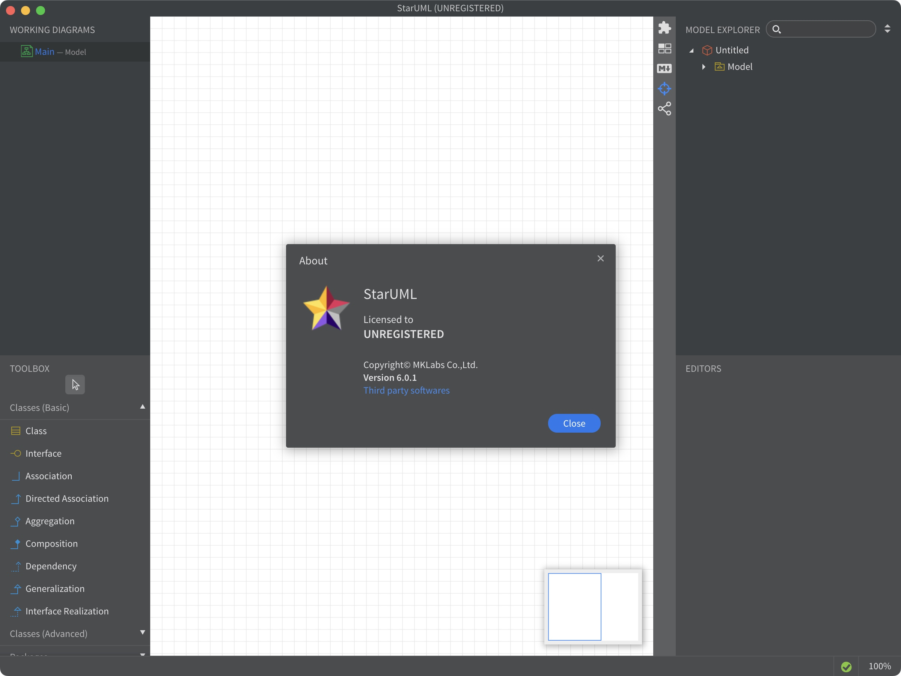

# 开始分析
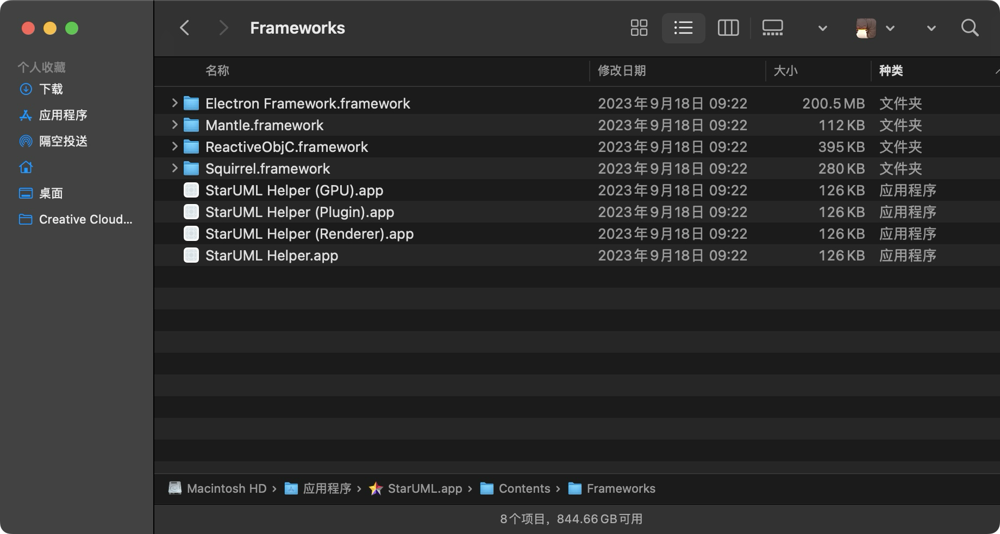
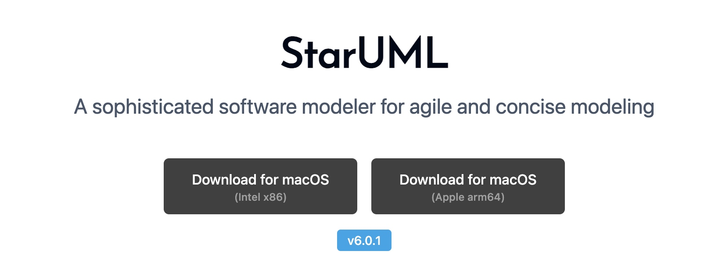

通过官网和包结构分析可以得出，StarUML大致是由Electron来开发的，那就简单多了

## 解包步骤
由于StarUML是Electron开发，所以第一步，我们需要对他的asar包进行解包
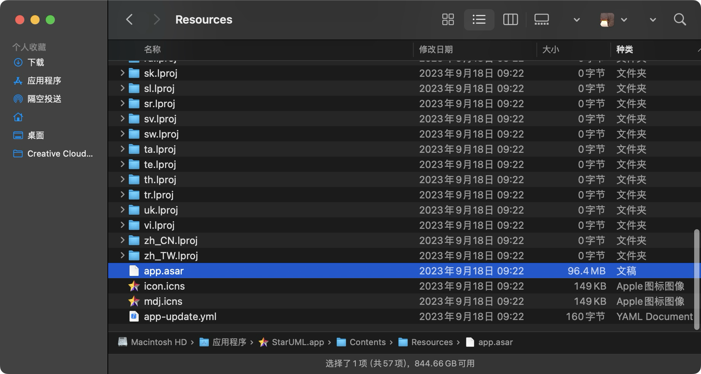
找到该文件，备份一份，开始解包
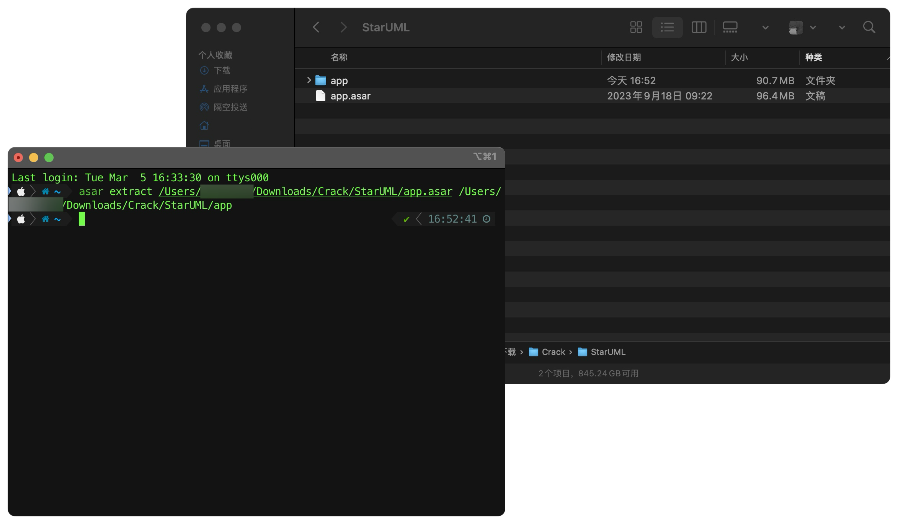
解包完成后，我们得到了一个app文件夹

我们先通过VS Code打开
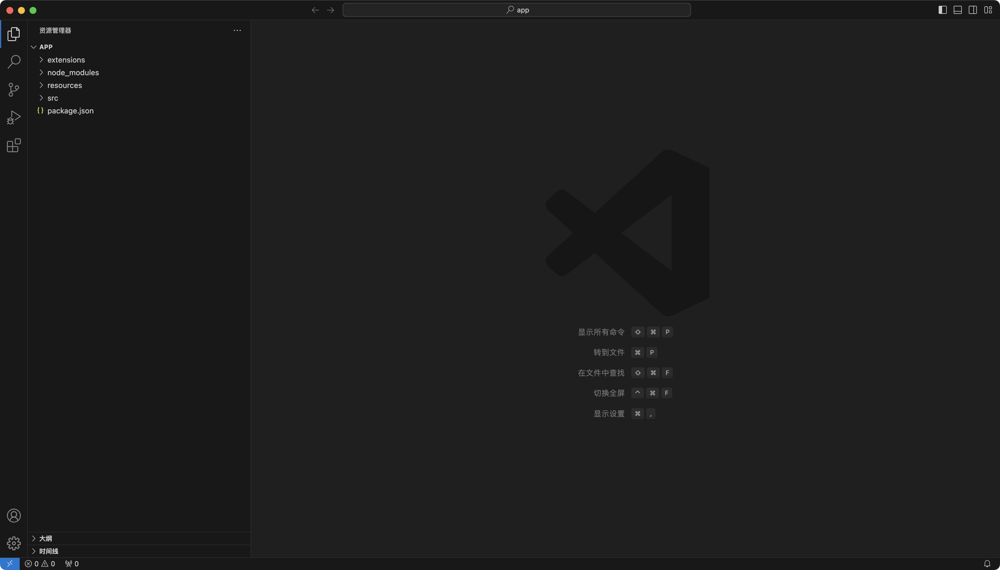

接下来，我们先丢一边，先运行StarUML


开门见山，大大的 Unregistered Version 很显然表示是未购买版本
通过初步搜索，我们得出如下结果
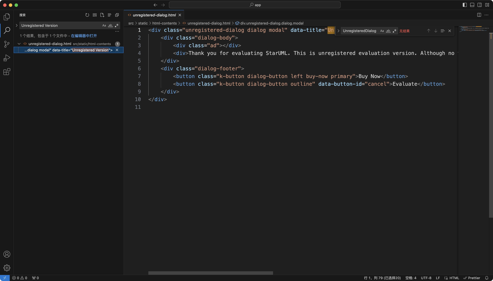

可以暂时看出这个弹窗是来自于一个html文件，那么，肯定有一个地方是调用这个文件的，我们再次进行搜索
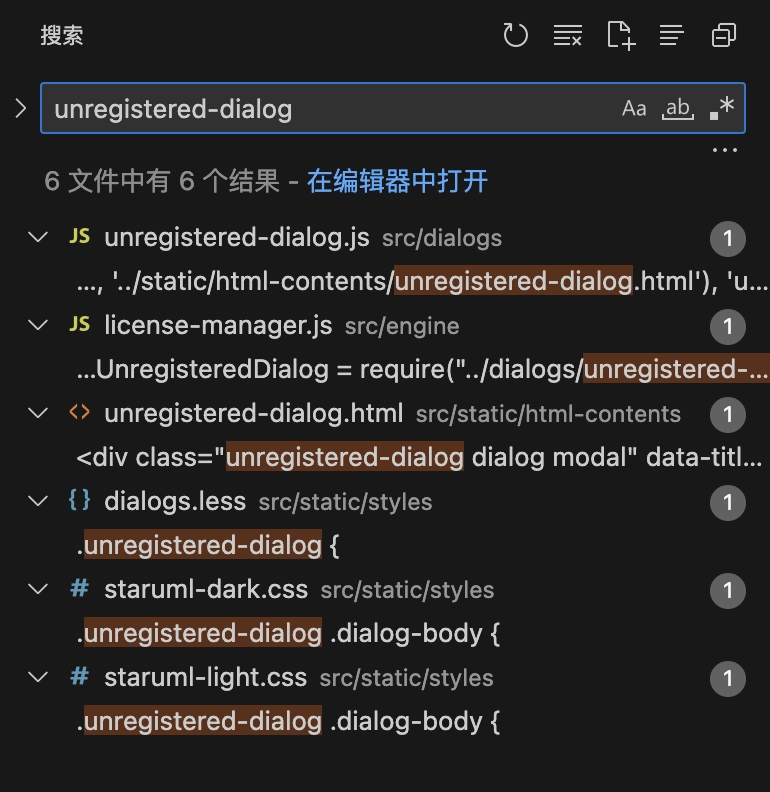
通过搜索，第三个是刚才的html弹窗，下面三个是css和less文件，前两个是js文件，可以确定的是，这两个js是非常有用的，我们一个一个分析
## unregistered-dialog.js分析
所有代码如下
```js
/*
* Copyright (c) 2013-2014 Minkyu Lee. All rights reserved.
*
* NOTICE:  All information contained herein is, and remains the
* property of Minkyu Lee. The intellectual and technical concepts
* contained herein are proprietary to Minkyu Lee and may be covered
* by Republic of Korea and Foreign Patents, patents in process,
* and are protected by trade secret or copyright law.
* Dissemination of this information or reproduction of this material
* is strictly forbidden unless prior written permission is obtained
* from Minkyu Lee (niklaus.lee@gmail.com).
*
*/

const {shell} = require('electron')
const fs = require('fs')
const Mustache = require('mustache')
const path = require('path')
const Strings = require('../strings')

const unregisteredDialogTemplate = fs.readFileSync(path.join(__dirname, '../static/html-contents/unregistered-dialog.html'), 'utf8')

/**
 * Show License Manager Dialog
 * @private
 * @return {Dialog}
 */
function showDialog () {
  var context = {
    Strings: Strings,
    metadata: global.app.metadata
  }
  var dialog = app.dialogs.showModalDialogUsingTemplate(Mustache.render(unregisteredDialogTemplate, context))
  var $dlg = dialog.getElement()
  var $buyNow = $dlg.find('.buy-now')

  $buyNow.click(function () {
    shell.openExternal(app.config.purchase_url)
  })

  dialog.then(({buttonId}) => {
    if (buttonId === 'ok') {
    }
  })

  return dialog
}

exports.showDialog = showDialog
```

从上面的所有代码中，可以看出来，该js文件定义了一个`showDialog`函数，经过分析，当点击弹窗的 "Buy now" 按钮后，会跳转到购买链接，最后一行，则是导出该函数提供给其他地方使用，这个文件我们找不到有价值的东西，例如关于注册码，许可证，校验逻辑等等，所以这个文件我们可以跳过

## license-manager.js分析
```js
/*
 * Copyright (c) 2013-2014 Minkyu Lee. All rights reserved.
 *
 * NOTICE:  All information contained herein is, and remains the
 * property of Minkyu Lee. The intellectual and technical concepts
 * contained herein are proprietary to Minkyu Lee and may be covered
 * by Republic of Korea and Foreign Patents, patents in process,
 * and are protected by trade secret or copyright law.
 * Dissemination of this information or reproduction of this material
 * is strictly forbidden unless prior written permission is obtained
 * from Minkyu Lee (niklaus.lee@gmail.com).
 *
 */

const { EventEmitter } = require("events");
const fs = require("fs");
const path = require("path");
const crypto = require("crypto");
const UnregisteredDialog = require("../dialogs/unregistered-dialog");
const SK = "DF9B72CC966FBE3A46F99858C5AEE";
const packageJSON = require("../../package.json");

// Check License When File Save
const LICENSE_CHECK_PROBABILITY = 0.3;

const PRO_DIAGRAM_TYPES = [
  "SysMLRequirementDiagram",
  "SysMLBlockDefinitionDiagram",
  "SysMLInternalBlockDiagram",
  "SysMLParametricDiagram",
  "BPMNDiagram",
  "WFWireframeDiagram",
  "AWSDiagram",
  "GCPDiagram",
];

var status = false;
var licenseInfo = null;

/**
 * Set Registration Status
 * This function is out of LicenseManager class for the security reason
 * (To disable changing License status by API)
 * @private
 * @param {boolean} newStat
 * @return {string}
 */
function setStatus(licenseManager, newStat) {
  if (status !== newStat) {
    status = newStat;
    licenseManager.emit("statusChanged", status);
  }
}

/**
 * @private
 */
class LicenseManager extends EventEmitter {
  constructor() {
    super();
    this.projectManager = null;
  }

  isProDiagram(diagramType) {
    return PRO_DIAGRAM_TYPES.includes(diagramType);
  }

  /**
   * Get Registration Status
   * @return {string}
   */
  getStatus() {
    return status;
  }

  /**
   * Get License Infomation
   * @return {Object}
   */
  getLicenseInfo() {
    return licenseInfo;
  }

  findLicense() {
    var licensePath = path.join(app.getUserPath(), "/license.key");
    if (!fs.existsSync(licensePath)) {
      licensePath = path.join(app.getAppPath(), "../license.key");
    }
    if (fs.existsSync(licensePath)) {
      return licensePath;
    } else {
      return null;
    }
  }

  /**
   * Check license validity
   *
   * @return {Promise}
   */
  validate() {
    return new Promise((resolve, reject) => {
      try {
        // Local check
        var file = this.findLicense();
        if (!file) {
          reject("License key not found");
        } else {
          var data = fs.readFileSync(file, "utf8");
          licenseInfo = JSON.parse(data);
          if (licenseInfo.product !== packageJSON.config.product_id) {
            app.toast.error(
              `License key is for old version (${licenseInfo.product})`,
            );
            reject(`License key is not for ${packageJSON.config.product_id}`);
          } else {
            var base =
              SK +
              licenseInfo.name +
              SK +
              licenseInfo.product +
              "-" +
              licenseInfo.licenseType +
              SK +
              licenseInfo.quantity +
              SK +
              licenseInfo.timestamp +
              SK;
            var _key = crypto
              .createHash("sha1")
              .update(base)
              .digest("hex")
              .toUpperCase();
            if (_key !== licenseInfo.licenseKey) {
              reject("Invalid license key");
            } else {
              // Server check
              $.post(app.config.validation_url, {
                licenseKey: licenseInfo.licenseKey,
              })
                .done((data) => {
                  resolve(data);
                })
                .fail((err) => {
                  if (err && err.status === 499) {
                    /* License key not exists */
                    reject(err);
                  } else {
                    // If server is not available, assume that license key is valid
                    resolve(licenseInfo);
                  }
                });
            }
          }
        }
      } catch (err) {
        reject(err);
      }
    });
  }

  checkLicenseValidity() {
    if (packageJSON.config.setappBuild) {
      setStatus(this, true);
    } else {
      this.validate().then(
        () => {
          setStatus(this, true);
        },
        () => {
          setStatus(this, false);
          UnregisteredDialog.showDialog();
        },
      );
    }
  }

  /**
   * Check the license key in server and store it as license.key file in local
   *
   * @param {string} licenseKey
   */
  register(licenseKey) {
    return new Promise((resolve, reject) => {
      $.post(app.config.validation_url, { licenseKey: licenseKey })
        .done((data) => {
          if (data.product === packageJSON.config.product_id) {
            var file = path.join(app.getUserPath(), "/license.key");
            fs.writeFileSync(file, JSON.stringify(data, 2));
            licenseInfo = data;
            setStatus(this, true);
            resolve(data);
          } else {
            setStatus(this, false);
            reject("unmatched"); /* License is for old version */
          }
        })
        .fail((err) => {
          setStatus(this, false);
          if (err.status === 499) {
            /* License key not exists */
            reject("invalid");
          } else {
            reject();
          }
        });
    });
  }

  htmlReady() {
    this.projectManager.on("projectSaved", (filename, project) => {
      var val = Math.floor(Math.random() * (1.0 / LICENSE_CHECK_PROBABILITY));
      if (val === 0) {
        this.checkLicenseValidity();
      }
    });
  }

  appReady() {
    this.checkLicenseValidity();
  }
}

module.exports = LicenseManager;
```

这个js文件就非常有意思了，从
```js
const UnregisteredDialog = require("../dialogs/unregistered-dialog");
```
中我们可以看出，刚才的弹框导出，被这里使用了，我们来看看在什么情况下，他会触发这个Dialog

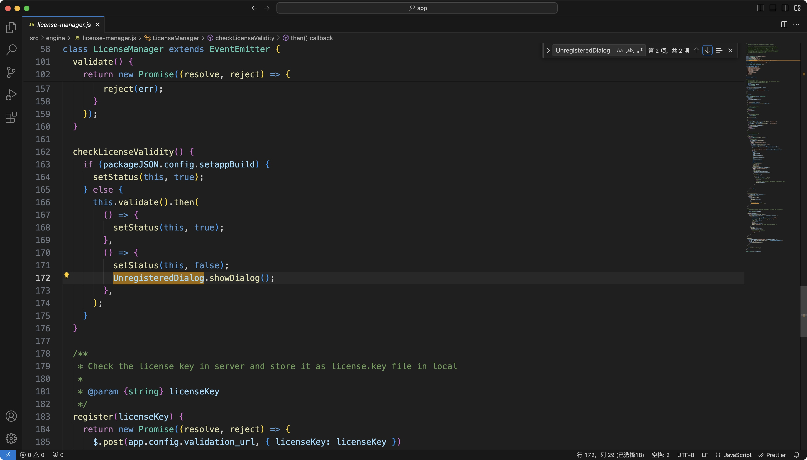

通过文件内搜索，我们可以定位到如下函数，以下函数经过补全
```js
function checkLicenseValidity() {
    if (packageJSON.config.setappBuild) {
      setStatus(this, true);
    } else {
      this.validate().then(
        () => {
          setStatus(this, true);
        },
        () => {
          setStatus(this, false);
          UnregisteredDialog.showDialog();
        },
      );
    }
}
```

我们可以从该函数中定位到`UnregisteredDialog.showDialog();`
逻辑如下
判断`packageJSON.config.setappBuild`，初步判断该值为逻辑值或对象值，若该值为`true`或不为`undefined`，则执行`setStatus(this, true);`

很显然，弹窗走的逻辑是`else`，也就是该值不存在，但是，在弹窗前，我们会发现，`else`后还执行了一个函数`this.validate()`，看到后面的`.then()`可以知道，这个函数肯定返回了一个用`Promise`包装过的对象，我们来分析一下`this.validate()`这个函数

```js
/**
* Check license validity
*
* @return {Promise}
*/
function validate() {
    return new Promise((resolve, reject) => {
      try {
        // Local check
        var file = this.findLicense();
        if (!file) {
          reject("License key not found");
        } else {
          var data = fs.readFileSync(file, "utf8");
          licenseInfo = JSON.parse(data);
          if (licenseInfo.product !== packageJSON.config.product_id) {
            app.toast.error(
              `License key is for old version (${licenseInfo.product})`,
            );
            reject(`License key is not for ${packageJSON.config.product_id}`);
          } else {
            var base =
              SK +
              licenseInfo.name +
              SK +
              licenseInfo.product +
              "-" +
              licenseInfo.licenseType +
              SK +
              licenseInfo.quantity +
              SK +
              licenseInfo.timestamp +
              SK;
            var _key = crypto
              .createHash("sha1")
              .update(base)
              .digest("hex")
              .toUpperCase();
            if (_key !== licenseInfo.licenseKey) {
              reject("Invalid license key");
            } else {
              // Server check
              $.post(app.config.validation_url, {
                licenseKey: licenseInfo.licenseKey,
              })
                .done((data) => {
                  resolve(data);
                })
                .fail((err) => {
                  if (err && err.status === 499) {
                    /* License key not exists */
                    reject(err);
                  } else {
                    // If server is not available, assume that license key is valid
                    resolve(licenseInfo);
                  }
                });
            }
          }
        }
      } catch (err) {
        reject(err);
      }
    });
}
```
通过上述的代码，证明我们的猜测是没错的，确实返回了一个`Promise`包装的对象，我们继续往下看，函数的大致逻辑如下

定义了`file`变量，执行`this.findLicense()`函数
为此，我们深入分析一下

```js
function findLicense() {
    var licensePath = path.join(app.getUserPath(), "/license.key");
    if (!fs.existsSync(licensePath)) {
      licensePath = path.join(app.getAppPath(), "../license.key");
    }
    if (fs.existsSync(licensePath)) {
      return licensePath;
    } else {
      return null;
    }
}
```

这个函数非常简单，通过 NodeJS内置的 path 模块来拼接一个文件地址，然后通过 NodeJS内置的 fs 模块来寻找地址中的文件是否存在，如果不存在，那么`license.key`不存在于当前目录，可能存在于上一级目录，所以重新拼接

再次利用 NodeJS 内置的 fs 模块进行寻找，若找到了，则返回文件地址，若找不到，返回null

该函数分析完毕，回到刚才的`validate`函数

```js
if (!file) {
  reject("License key not found");
}
```
通过我们刚才对`findLicense`的分析，我们可以知道，`license.key`不存在，所以此时`reject("License key not found");`

要想走通`else`逻辑，我们就需要让`license.key`存在，那么，如何让`license.key`存在呢，继续本页面内搜索

通过搜索，我们发现，在`register`函数中也用到了这个`license.key`文件，那我们此时就可以怀疑，文件是由这个函数进行生成的
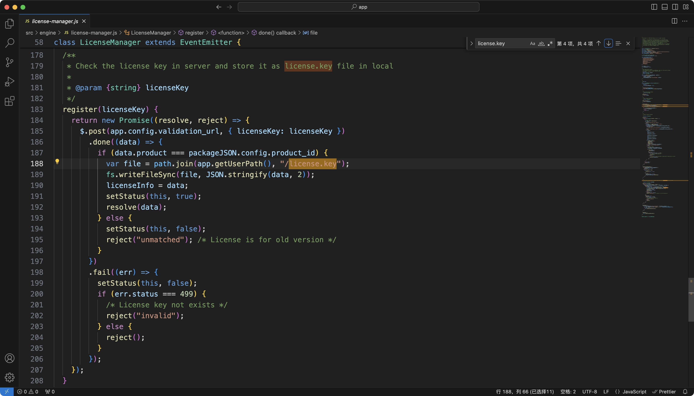

看看这个函数在做什么
```js
function register(licenseKey) {
    return new Promise((resolve, reject) => {
      $.post(app.config.validation_url, { licenseKey: licenseKey })
        .done((data) => {
          if (data.product === packageJSON.config.product_id) {
            var file = path.join(app.getUserPath(), "/license.key");
            fs.writeFileSync(file, JSON.stringify(data, 2));
            licenseInfo = data;
            setStatus(this, true);
            resolve(data);
          } else {
            setStatus(this, false);
            reject("unmatched"); /* License is for old version */
          }
        })
        .fail((err) => {
          setStatus(this, false);
          if (err.status === 499) {
            /* License key not exists */
            reject("invalid");
          } else {
            reject();
          }
        });
    });
}
```

不需要理解这么多，我们只需要看这两行
```js
var file = path.join(app.getUserPath(), "/license.key");
fs.writeFileSync(file, JSON.stringify(data, 2));
```
这两行足矣证明，`license.key`是由这个函数生成或写入的，那我们可以对这个函数进行动手，动手前，我们还是来聊一下这个函数的逻辑

该函数通过`$.post()`来发起一个`post`请求，请求地址为`app.config.validation_url`，请求体为`{ licenseKey: licenseKey }`，当发送完成后，比对服务器下发的数据和本身的包数据进行比对，若`product`相等，则写入`license.key`文件，把下发的数据赋值给`licenseInfo`

其他的就不用看了，那么，到这里，我们就更确定我们需要对这个函数动手，首先，我们需要修改原逻辑，原来是发送`post`请求的，我们修改为不需要发送请求，直接写入`license.key`文件，那么问题来了，我们怎么确定服务器下发的内容那些我们需要用，哪些没用呢

通过搜索`licenseInfo`我们从同文件可得出如下关于`licenseInfo`的代码

```js
// line 38
var licenseInfo = null;

// line 80 - 82
getLicenseInfo() {
    return licenseInfo;
}

// line 110 - 111
licenseInfo = JSON.parse(data);
if (licenseInfo.product !== packageJSON.config.product_id)

// line 117 - 128
var base =
      SK +
      licenseInfo.name +
      SK +
      licenseInfo.product +
      "-" +
      licenseInfo.licenseType +
      SK +
      licenseInfo.quantity +
      SK +
      licenseInfo.timestamp +
      SK;

// line 143
if (_key !== licenseInfo.licenseKey)
```
综上所属，我们可以得出，`licenseInfo`中的属性和结构大致如下
```js
let data = {
    name: "",
    product: "",
    licenseType: "",
    quantity: "",
    timestamp: "",
    licenseKey: "",
    crackedAuthor: ""
}
```
有了结构和属性之后，我们就需要找出对应的值大概是什么
我们可以一个一个分析
### name值来源
我们发现，无论怎么搜索怎么寻找，都无法找到name值的来源，那么，我们大胆一点，只要name是字符串即可
```js
let data = {
    name: "X1a0He",
    product: "",
    licenseType: "",
    quantity: "",
    timestamp: "",
    licenseKey: "",
    crackedAuthor: ""
}
```
### product值来源
由同文件代码中，我们可以看出，`product`是跟`packageJSON.config.product_id`进行对比的，既然要对比，那么我们直接让他们永远相等，我们在`package.json`文件中的`config`值中可以找到，`product_id`为`STARUML.V6`
```js
licenseInfo.product !== packageJSON.config.product_id
```
paskage.json中的config配置
```js
"config": {
    "product_id": "STARUML.V6",
    "app_title": "StarUML",
    "app_icon": "styles/icons/logo_64.png",
    "download_url": "https://staruml.io/download",
    "purchase_url": "https://staruml.io/buy",
    "validation_url": "https://staruml.io/api/license/validate",
    "documentation_url": "https://docs.staruml.io",
    "forum_url": "https://groups.google.com/forum/#!forum/staruml",
    "release_notes_url": "https://staruml.io/download",
    "feature_request_url": "https://staruml.uservoice.com",
    "thirdparty_licenses_url": "https://staruml.io/thirdparty",
    "defaultTemplate": "Default.mdj",
    "extension_registry": "https://staruml.io/api/extensions/registry.json",
    "extension_url": "https://staruml.io/api/extensions/{0}/{0}-{1}.zip"
}
```
此时，我们的data更新为
```js
let data = {
    name: "X1a0He",
    product: "STARUML.V6",
    licenseType: "",
    quantity: "",
    timestamp: "",
    licenseKey: "",
    crackedAuthor: ""
}
```
### licenseType值来源
在`about-dialog.js`中，我们发现一段代码非常可疑
```js
// set license info
  if (app.licenseManager.getStatus() === true) {
    if (app.config.setappBuild) {
      $licenseToLabel.hide();
    }
    var info = app.licenseManager.getLicenseInfo();
    var licenseTypeName = "Unknown";
    switch (info.licenseType) {
      case "STD":
        licenseTypeName = "Standard Edition";
        break;
      case "PRO":
        licenseTypeName = "Professional Edition";
        break;
    }
    $license.html(info.name);
    $licenseType.html(licenseTypeName);
    $quantity.html(info.quantity + " User(s)");
  } else {
    $license.html("UNREGISTERED");
  }
```
通过上面的逻辑代码，我们可以得出一个结论，`licenseType`的值可以为如下
- STD
- PRO

既然我们要破解，那么我们就拉满，直接让`licenseType`为 PRO
```js
let data = {
    name: "X1a0He",
    product: "STARUML.V6",
    licenseType: "PRO",
    quantity: "",
    timestamp: "",
    licenseKey: "",
    crackedAuthor: ""
}
```
### quantity值来源
如果你不是弱智，那么可以直接得出`quantity`的中文为数量，我们猜测是绑定设备的数量，那么，直接拉满
```js
let data = {
    name: "X1a0He",
    product: "STARUML.V6",
    licenseType: "PRO",
    quantity: "999",
    timestamp: "",
    licenseKey: "",
    crackedAuthor: ""
}
```
### timestamp值来源
这个值出现的时候，只要了解过程序的，基本上都知道这是时间戳，直接赋值
```js
let data = {
    name: "X1a0He",
    product: "STARUML.V6",
    licenseType: "PRO",
    quantity: "999",
    timestamp: `${Math.round(new Date() / 1000)}`,
    licenseKey: "",
    crackedAuthor: ""
}
```
### licenseKey值来源
licenseKey只要你不是弱智都知道licenseKey就是你输入的注册码，就算你不知道，在`register`函数中也可以找到这个值
```js
/**
 * Check the license key in server and store it as license.key file in local
 *
 * @param {string} licenseKey
*/
function register(licenseKey)
```
所以，只要你喜欢，它可以是任何值
```js
let data = {
    name: "X1a0He",
    product: "STARUML.V6",
    licenseType: "PRO",
    quantity: "999",
    timestamp: `${Math.round(new Date() / 1000)}`,
    licenseKey: "88888888888888",
    crackedAuthor: ""
}
```
到这里，我们就完成了data的结构分析和属性赋值，但是，我们注意到还有一个值`crackedAuthor`还没处理

从字面意思来看，你觉得这个值该写什么好呢
```js
let data = {
    name: "X1a0He",
    product: "STARUML.V6",
    licenseType: "PRO",
    quantity: "999",
    timestamp: `${Math.round(new Date() / 1000)}`,
    licenseKey: "88888888888888",
    crackedAuthor: "X1a0He"
}
```

好，做完这些准备工作之后，我们就可以修改`register`函数了

刚才说了，他要发`post`请求，我们就不让他发，所以我们需要修改为如下
```js
register(licenseKey) {
    return new Promise((resolve, reject) => {
      let data = {
        name: "X1a0He",
        product: "STARUML.V6",
        licenseType: "PRO",
        quantity: "999",
        timestamp: `${Math.round(new Date() / 1000)}`,
        licenseKey: "88888888888888",
        crackedAuthor: "X1a0He"
      }
      var file = path.join(app.getUserPath(), "/license.key");
      fs.writeFileSync(file, JSON.stringify(data, 2));
      licenseInfo = data;
      setStatus(this, true);
      resolve(data);
    });
  }
```

我们还需要修改一个地方是，当前文件下的`isProDiagram`函数
```js
isProDiagram(diagramType) {
    return PRO_DIAGRAM_TYPES.includes(diagramType);
}
```
该函数判断是否为`Pro`，我们直接返回`true`

接着，我们还需要对`validate`函数动手脚，由于该函数也是发送post请求的，所以同样的道理，我们直接修改
```js
validate() {
    return new Promise((resolve, reject) => {
      try {
        // Local check
        var file = this.findLicense();
        if (!file) {
          reject("License key not found");
        } else {
          var data = fs.readFileSync(file, "utf8");
          licenseInfo = JSON.parse(data);
          resolve(licenseInfo);
        }
      } catch (err) {
        reject(err);
      }
    });
  }
```

这时，我们就完成了函数的处理，我们保存，保存后，用如下命令打包
```bash
asar pack /Users/xxxxx/Downloads/Crack/StarUML/app /Users/xxxxx/Downloads/Crack/StarUML/app.asar
```
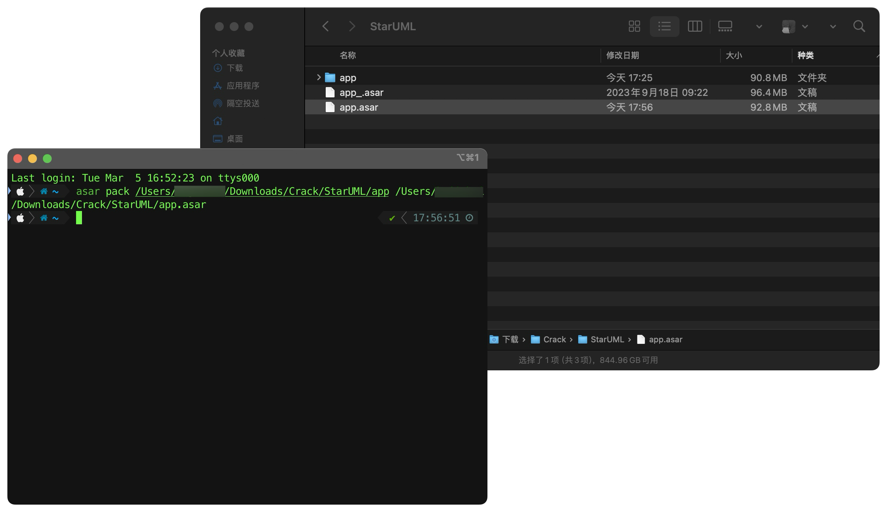
完成打包后，我们将该文件丢会StarUML包里，由于修改程序会导致系统提示软件已经损坏，所以我们需要通过在终端输入如下命令来修复
```bash
sudo xattr -rd com.apple.quarantine /Applications/StarUML.app
```

现在，我们就可以打开StarUML了
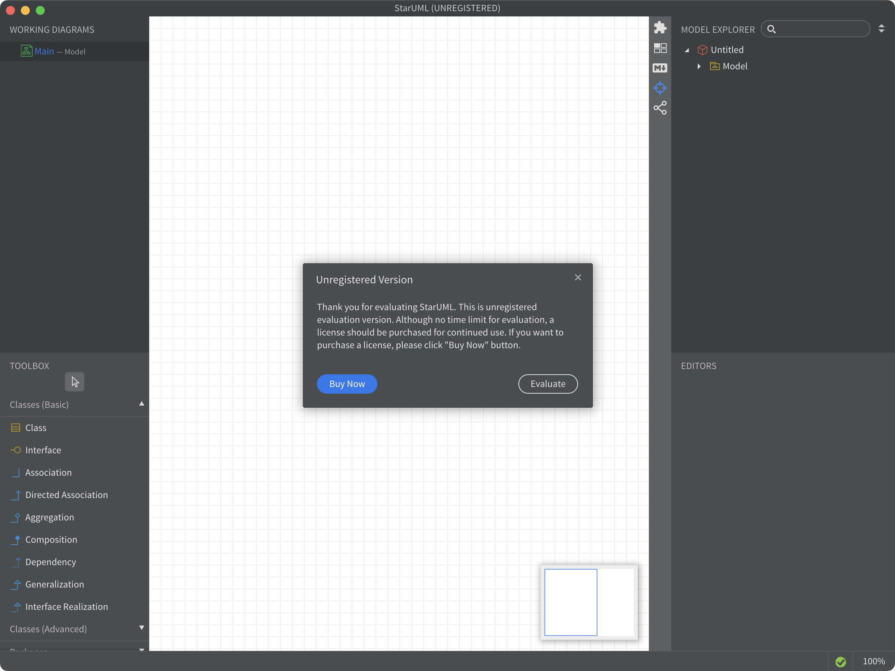
我们会发现，还是弹出未注册弹框，别急，找到
Help - Enter License Key

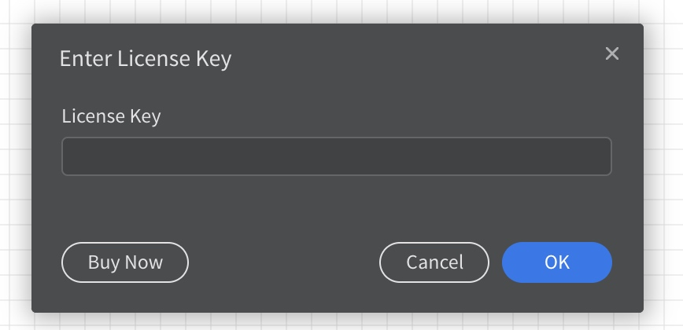
这时，直接点OK，你会发现\
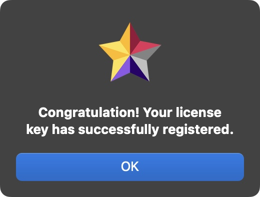

这时我们点击左上角的About
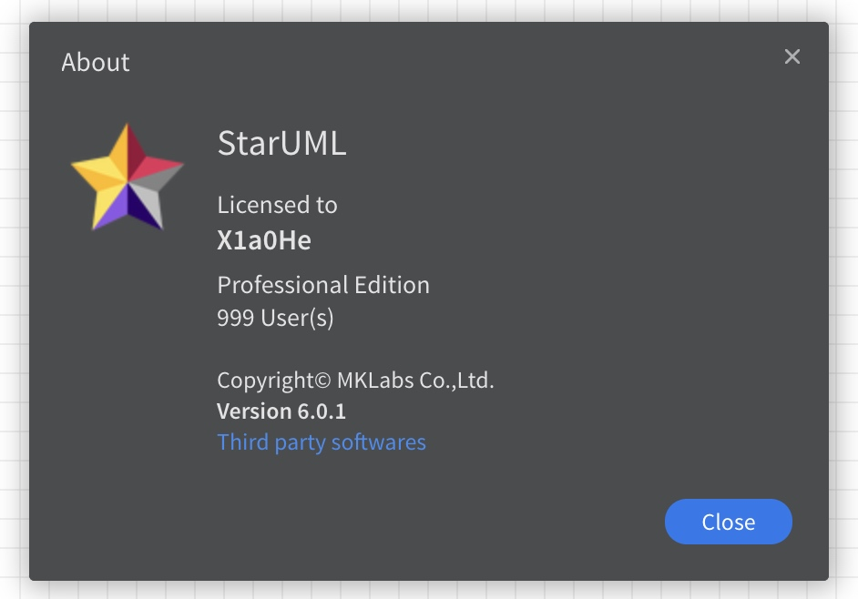

成功！ 