# StarUML两种破解方式

# 原创声明

**Author: [@X1a0He](https://t.me/X1a0He)**
**Github: [https://github.com/X1a0He/StarUML-CrackedAndTranslate](https://github.com/X1a0He/StarUML-CrackedAndTranslate)
**

# 准备工作

- StarUML 6.1.0 for Mac (Apple Silicon)
- VS Code

**本文所有工具均由官网下载并安装**

> 此处用 Mac 做演示，Windows或Linux同理

# 效果演示

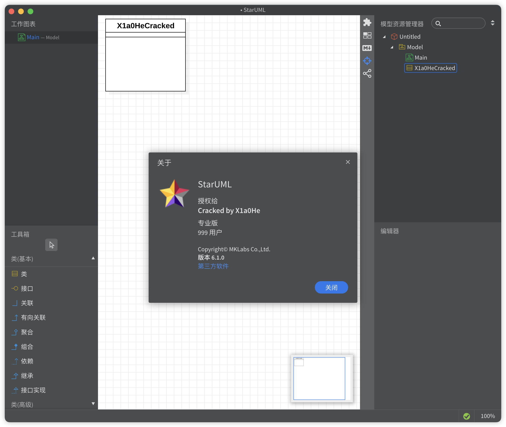

# 教程开始

运行StarUML，页面提示未注册，弹窗如图
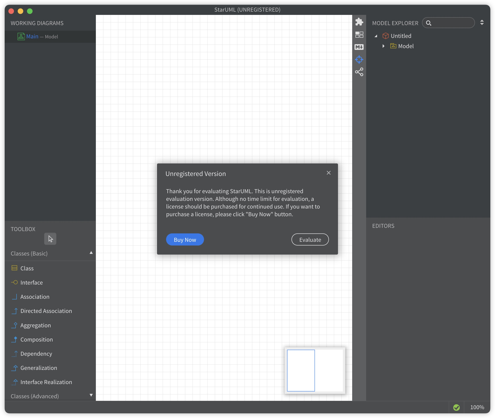

由于 StarUML 是采用 `electron` 技术开发的，所以，我们可以对他的`asar`包进行解包分析

`asar`包位于如下位置\
Mac: /Applications/StarUML.app/Contents/Resources/app.asar \
Win: C:\Program Files\StarUML\resources\app.asar

## 解包操作

### 解包前的准备工作

解包之前，需要安装NodeJS，并且安装`@electron/asar`包

NodeJS安装过程不再演示
NodeJS官网: [https://nodejs.org/en/download](https://nodejs.org/en/download)

当安装好NodeJS后，打开「终端」或「cmd」，运行下列命令

```bash
node --version && npm --version
```

当输出如下

```bash
v21.7.3
10.5.2
```

即为安装成功

接下来安装`@electron/asar`

```bash
npm i -g @electron/asar
```

看到如下提示信息即安装完成

```bash
added 13 packages in 3s

1 package is looking for funding
run `npm fund` for details
```

查看`asar`版本

```bash
asar --version
```

### 正式解包

打开你的「终端」或者「cmd」，输入如下格式的命令

```bash
asar extract app.asar的路径 解包后文件夹全路径名
```

举例如下

```bash
asar extract /Applications/StarUML.app/Contents/Resources/app.asar /Applications/StarUML.app/Contents/Resources/app
```

这时，你就可以在`app.asar`同目录下看到一个`app`文件夹，如图所示


## 关键词搜索

还记得刚才的未注册提示吗
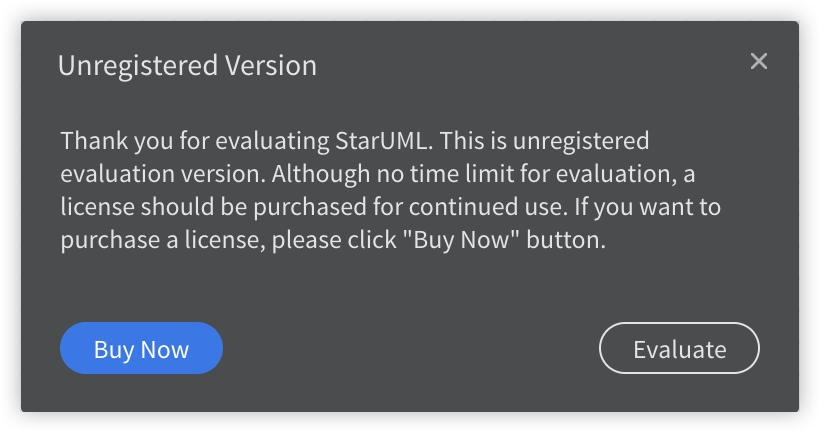

我们重点关注 `Unregistered Version`，打开VS Code，拖入刚才解包后的`app`文件夹
按下快捷键全局搜索\
Mac: `command` + `shift` + `f`\
Win: `ctrl` + `shift` + `f`

输入`Unregistered Version`后，得到文件引用
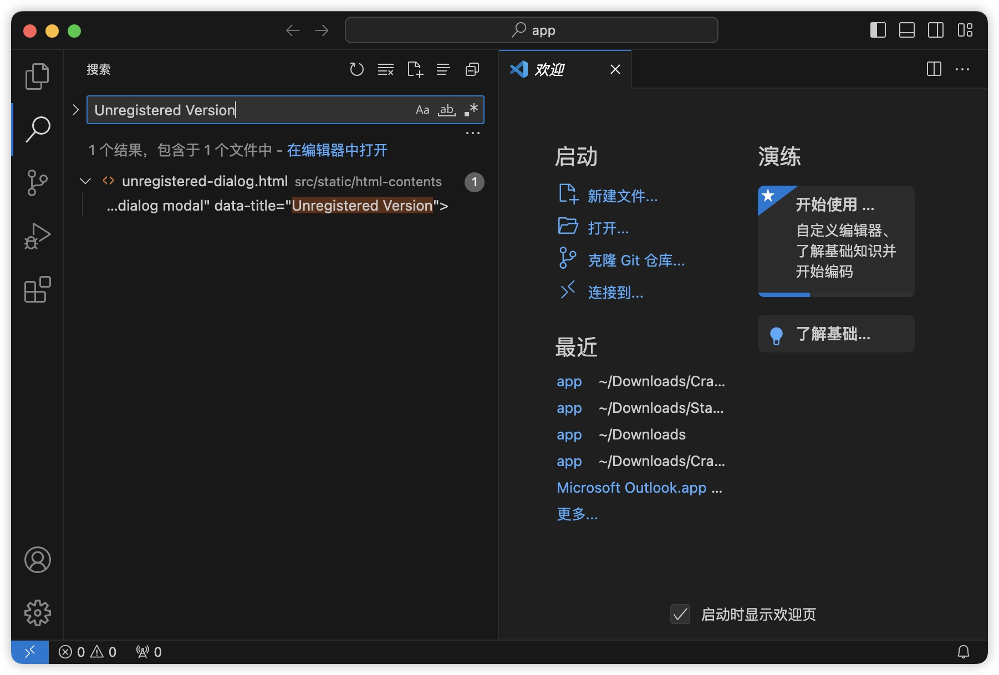
该文件位于

```
app/src/static/html-contents/unregistered-dialog.html
```

这个就是弹窗的所有内容，我们看哪里引用了这个文件，搜索文件名`unregistered-dialog.html`，得到如下结果
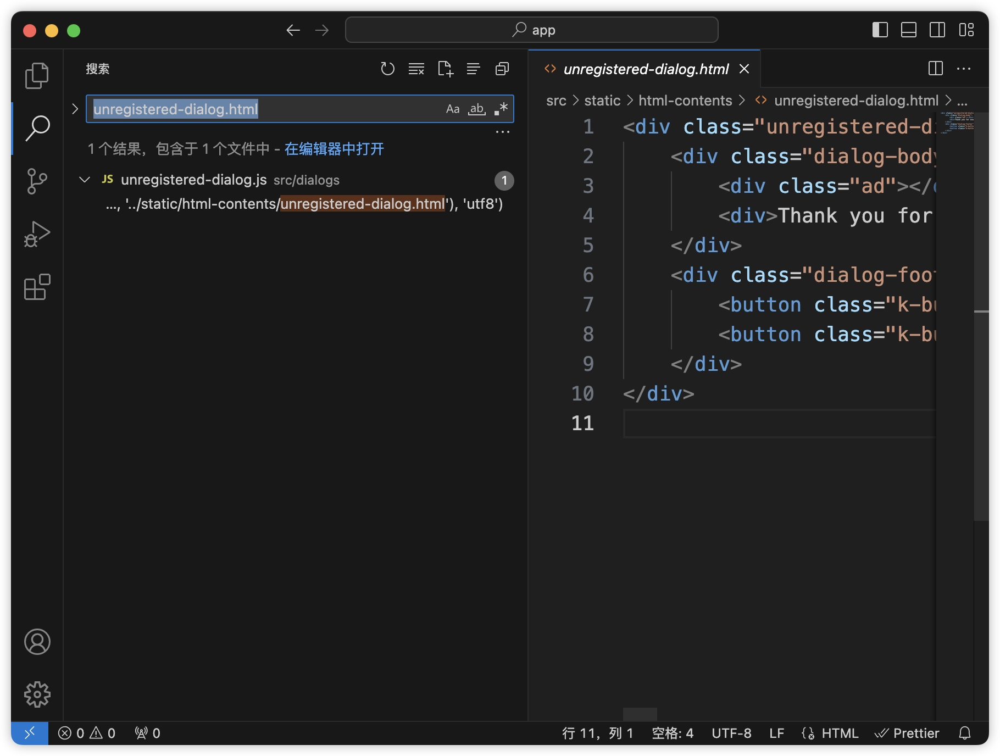
该文件位于

```
app/src/dialogs/unregistered-dialog.js
```

分析一下这个文件

```js
const {shell} = require('electron')
const fs = require('fs')
const Mustache = require('mustache')
const path = require('path')
const Strings = require('../strings')

const unregisteredDialogTemplate = fs.readFileSync(path.join(__dirname, '../static/html-contents/unregistered-dialog.html'), 'utf8')

/**
 * Show License Manager Dialog
 * @private
 * @return {Dialog}
 */
function showDialog() {
    var context = {
        Strings: Strings,
        metadata: global.app.metadata
    }
    var dialog = app.dialogs.showModalDialogUsingTemplate(Mustache.render(unregisteredDialogTemplate, context))
    var $dlg = dialog.getElement()
    var $buyNow = $dlg.find('.buy-now')

    $buyNow.click(function () {
        shell.openExternal(app.config.purchase_url)
    })

    dialog.then(({buttonId}) => {
        if (buttonId === 'ok') {
        }
    })

    return dialog
}

exports.showDialog = showDialog
```

仔细看一下，最后一行，把一个方法导出给其他地方使用
OK，继续搜索`unregistered-dialog`
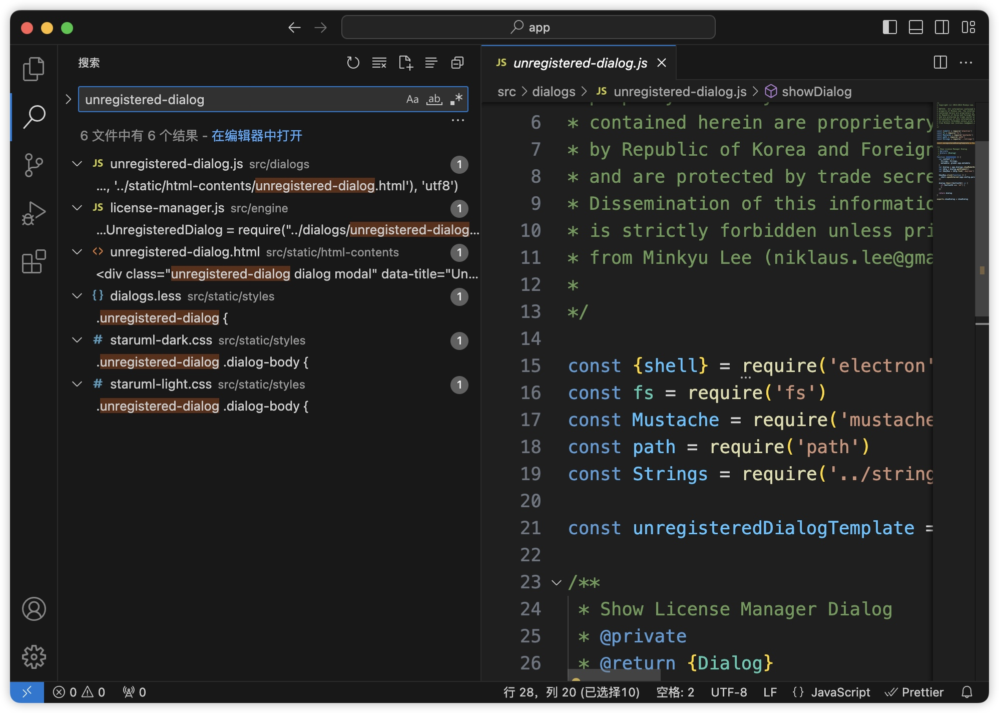
非常好，现在只有两个有用的文件不是吗

- unregistered-dialog.js
- license-manager.js

我们知道`unregistered-dialog.js`已经被分析了，那么就剩下了`license-manager.js`

## license-manager分析

`license-manager.js`主要结构如下

```js
const {EventEmitter} = require("events");
const fs = require("fs");
const path = require("path");
const crypto = require("crypto");
const UnregisteredDialog = require("../dialogs/unregistered-dialog");
const SK = "DF9B72CC966FBE3A46F99858C5AEE";
const packageJSON = require("../../package.json");

// Check License When File Save
const LICENSE_CHECK_PROBABILITY = 0.3;

const PRO_DIAGRAM_TYPES = [];

var status = false;
var licenseInfo = null;

function setStatus(licenseManager, newStat) {
}

class LicenseManager extends EventEmitter {
}

isProDiagram(diagramType)
{
}

getStatus()
{
}

getLicenseInfo()
{
}

findLicense()
{
}

validate()
{
}

checkLicenseValidity()
{
}

register(licenseKey)
{
}

htmlReady()
{
}

appReady()
{
}
}

module.exports = LicenseManager;
```

为了让看教程的你能懂这个函数在干什么，接下来，我会非常详细的慢慢分析

### 变量分析

```js
const {EventEmitter} = require("events");
const fs = require("fs");
const path = require("path");
const crypto = require("crypto");
const UnregisteredDialog = require("../dialogs/unregistered-dialog");
const SK = "DF9B72CC966FBE3A46F99858C5AEE";
const packageJSON = require("../../package.json");

// Check License When File Save
const LICENSE_CHECK_PROBABILITY = 0.3;

const PRO_DIAGRAM_TYPES = [];

var status = false;
var licenseInfo = null;
```

不需要知道前几行在干什么，只需要知道

```js
const UnregisteredDialog = require("../dialogs/unregistered-dialog");
const SK = "DF9B72CC966FBE3A46F99858C5AEE";
const packageJSON = require("../../package.json");

var status = false;
var licenseInfo = null;
```

第一行: 未注册弹窗方法的引入\
第二行: SK值，用于计算加密注册码\
第三行: 用于许可证信息的某个字段校验\
第四行: 用于StarUML内部校验是否已注册\
第五行: licenseInfo许可证信息

### 函数分析

该文件下所有函数如下

```js
function setStatus(licenseManager, newStat) {
}

class LicenseManager extends EventEmitter {
}

isProDiagram(diagramType)
{
}

getStatus()
{
}

getLicenseInfo()
{
}

findLicense()
{
}

validate()
{
}

checkLicenseValidity()
{
}

register(licenseKey)
{
}

htmlReady()
{
}

appReady()
{
}
}

module.exports = LicenseManager;
```

- `setStatus`: 用于切换变量`status`的值，分别为`true`,`false`
- `isProDiagram`: 用于判断导出的图是否需要`Pro`许可资格
- `getStatus`: 获取当前激活状态，即`status`值
- `getLicenseInfo`: 获取licenseInfo许可证信息
- `findLicense`: 查找本地是否存在许可证文件
- `validate`: 对用户输入的注册码进行校验
- `checkLicenseValidity`: 间接调用`validate`函数，并切换激活状态
- `register`: 与服务器校验，根据服务器返回数据在本地生成对应的许可证文件
- `htmlReady`: 当用户执行保存操作后，通过随机值判断来进行校验注册码
- `appReady`: 程序启动后，运行`checkLicenseValidity`函数进行校验

### 详细分析

综上所述，我们首先要了解，为什么没有没激活的状态下，会弹窗，这个弹窗是怎么来的

由`UnregisteredDialog`可以在本文件中搜索到，该调用位于如下函数

```js
checkLicenseValidity()
{
    if (packageJSON.config.setappBuild) {
        setStatus(this, true);
    } else {
        this.validate().then(
            () => {
                setStatus(this, true);
            },
            () => {
                setStatus(this, false);
                UnregisteredDialog.showDialog();
            },
        );
    }
}
```

可以看到，我们的`UnregisteredDialog`位于`else`分支，意味着`packageJSON.config.setappBuild`为`false`
不需要理解这个值，这个值的由来如下

```js
const packageJSON = require("../../package.json");
```

读取到`packageJSON`文件内容后，查找`config`属性值，再查找`setappBuild`，根据字面量判断，该值用于判断是否为Mac端的`setapp`
编译来的，所以我们可知，这个值永远为`false`，所以不需要管

继续观察该函数，`else`分支下，调用了`validate()`函数，若`validate()`函数返回`resolve()`则将激活状态改为`true`
否则，将激活状态切换为`false`并弹窗

如果你尝试在 百度、Google中搜索，你会发现，千篇一律的 StarUML 破解，均将激活状态改为`true`并且注释或移除弹窗代码，修改后如下

```js
this.validate().then(
    () => {
        setStatus(this, true);
    },
    () => {
        setStatus(this, true);
        // UnregisteredDialog.showDialog();
    },
);
```

不可否认的是，这种修改方法，确实可以实现激活，耍了一点小聪明，但经过实际分析后可知，这种方法在导出图表的情况下会报错，我们可以来到
`app/src/engine/diagram-export.js`\
这个文件中看到一段代码如下

```js
if (app.licenseManager.getStatus() !== true) {
    drawWatermarkPDF(doc, 70, 12, "UNREGISTERED");
} else if (app.licenseManager.getLicenseInfo().licenseType === "STD") {
    const dgmType = diagram.constructor.name;
    if (app.licenseManager.isProDiagram(dgmType)) {
        drawWatermarkPDF(doc, 45, 12, "PRO ONLY");
    }
}
```

如果`licenseManager.getStatus()`获取到的注册状态不为`true`就将导出的图加水印，很显然，经过千篇一律的修改后，该分支不成立，则代码继续判断

若`app.licenseManager.getLicenseInfo().licenseType`为`STD`即标准版，则继续判断，OK，到这里我们就不需要继续分析了

当我们尝试导出的时候，执行`getLicenseInfo()`函数，该函数返回licenseInfo许可证信息，判断许可证信息的`licenseType`
值是否为`STD`，很显然，这个值并不存在，并且licenseInfo的值一直为null，所以该处代码出错，程序报错，中断了导出操作

我们当然不会这么做，这是非常愚蠢且不负责任的行为！

回到刚才

```js
this.validate().then(
    () => {
        setStatus(this, true);
    },
    () => {
        setStatus(this, false);
        UnregisteredDialog.showDialog();
    },
);
```

通过上述代码，我们来分析`validate()`，代码如下

```js
validate()
{
    return new Promise((resolve, reject) => {
        try {
            // Local check
            var file = this.findLicense();
            if (!file) {
                reject("License key not found");
            } else {
                var data = fs.readFileSync(file, "utf8");
                licenseInfo = JSON.parse(data);
                if (licenseInfo.product !== packageJSON.config.product_id) {
                    app.toast.error(
                        `License key is for old version (${licenseInfo.product})`,
                    );
                    reject(`License key is not for ${packageJSON.config.product_id}`);
                } else {
                    var base =
                        SK +
                        licenseInfo.name +
                        SK +
                        licenseInfo.product +
                        "-" +
                        licenseInfo.licenseType +
                        SK +
                        licenseInfo.quantity +
                        SK +
                        licenseInfo.timestamp +
                        SK;
                    var _key = crypto
                        .createHash("sha1")
                        .update(base)
                        .digest("hex")
                        .toUpperCase();
                    if (_key !== licenseInfo.licenseKey) {
                        reject("Invalid license key");
                    } else {
                        // Server check
                        $.post(app.config.validation_url, {
                            licenseKey: licenseInfo.licenseKey,
                        })
                            .done((data) => {
                                resolve(data);
                            })
                            .fail((err) => {
                                if (err && err.status === 499) {
                                    /* License key not exists */
                                    reject(err);
                                } else {
                                    // If server is not available, assume that license key is valid
                                    resolve(licenseInfo);
                                }
                            });
                    }
                }
            }
        } catch (err) {
            reject(err);
        }
    });
}
```

这个代码非常长，我们可以分段分析，首先

```js
// Local check
var file = this.findLicense();
if (!file) {
    reject("License key not found");
}
```

通过作者的注释和逻辑行为可以分析出，该处代码是寻找许可证文件的，若许可证文件不存在，则返回`reject`状态

```js
else
{
    var data = fs.readFileSync(file, "utf8");
    licenseInfo = JSON.parse(data);
    if (licenseInfo.product !== packageJSON.config.product_id) {
        app.toast.error(
            `License key is for old version (${licenseInfo.product})`,
        );
        reject(`License key is not for ${packageJSON.config.product_id}`);
    }
}
```

很显然，如果走这里，那么许可证文件必然存在，代码会读出许可证内的信息，进行如下操作

- 判断许可证信息保存的`product`值是否为该版本的许可证文件，若不符合，则提示该许可证仅支持旧版本

```js
 else
{
    var base =
        SK +
        licenseInfo.name +
        SK +
        licenseInfo.product +
        "-" +
        licenseInfo.licenseType +
        SK +
        licenseInfo.quantity +
        SK +
        licenseInfo.timestamp +
        SK;
    var _key = crypto
        .createHash("sha1")
        .update(base)
        .digest("hex")
        .toUpperCase();
    if (_key !== licenseInfo.licenseKey) {
        reject("Invalid license key");
    } else {
        // Server check
        $.post(app.config.validation_url, {
            licenseKey: licenseInfo.licenseKey,
        })
            .done((data) => {
                resolve(data);
            })
            .fail((err) => {
                if (err && err.status === 499) {
                    /* License key not exists */
                    reject(err);
                } else {
                    // If server is not available, assume that license key is valid
                    resolve(licenseInfo);
                }
            });
    }
}
```

假设，许可证文件与版本一致，那么，代码就会拼接`SK`
值和许可证内的信息，拼接完成后，对拼接后的字符串进行加密运算，如果加密运算后的值，与许可证文件的`licenseKey`
值不匹配，则许可证无效或注册码无效

若此时通过了校验，则将该注册码发送到官方激活服务器进行再次校验，如果校验成功，则服务器会返回许可证信息，否则报错

到这里，我们非常详细分析完这个函数，但是始终没有说明，许可证文件是怎么来的，接下来，我们分析`register`函数

```js
register(licenseKey)
{
    return new Promise((resolve, reject) => {
        $.post(app.config.validation_url, {licenseKey: licenseKey})
            .done((data) => {
                if (data.product === packageJSON.config.product_id) {
                    var file = path.join(app.getUserPath(), "/license.key");
                    fs.writeFileSync(file, JSON.stringify(data, 2));
                    licenseInfo = data;
                    setStatus(this, true);
                    resolve(data);
                } else {
                    setStatus(this, false);
                    reject("unmatched"); /* License is for old version */
                }
            })
            .fail((err) => {
                setStatus(this, false);
                if (err.status === 499) {
                    /* License key not exists */
                    reject("invalid");
                } else {
                    reject();
                }
            });
    });
}
```

大部分逻辑跟刚才类似，该函数做了以下操作

- 与服务器进行注册码校验
- 校验成功，判断版本
- 若版本一致，则将服务器返回信息写入到本地许可证文件，名为`license.key`

综上所述，我们知道，服务器返回的信息非常重要，且`license.key`里的信息即licenseInfo信息，那么通过分析后，我们得知licenseInfo的结构大致如下

```js
let licenseInfo = {
    name: "",           // 授权于XXX
    product: "",        // 判断版本是否一致
    licenseType: "",    // 许可证类型
    quantity: "",       // 可授权设备数量
    timestamp: "",      // 时间戳
    licenseKey: "",     // 注册码
}
```

## licenseInfo值来源

### name值

不需要多解释，`name`值就是你自定义的，想授权给谁，所以我们一步到位

```js
let licenseInfo = {
    name: "Cracked by X1a0He",
    product: "",        // 判断版本是否一致
    licenseType: "",    // 许可证类型
    quantity: "",       // 可授权设备数量
    timestamp: "",      // 时间戳
    licenseKey: "",     // 注册码
}
```

### product值

刚才说了，`product`值是用来校验版本的，那么这个值跟谁比较呢，我们可以从刚才的分析得出

```js
licenseInfo.product !== packageJSON.config.product_id
```

结合

```js
const packageJSON = require("../../package.json");
```

我们可以在`package.json`这个文件中找到答案

```json
"config": {
"product_id": "STARUML.V6",
"app_title": "StarUML",
"app_icon": "styles/icons/logo_64.png",
"download_url": "https://staruml.io/download",
"purchase_url": "https://staruml.io/buy",
"validation_url": "https://staruml.io/api/license/validate",
"documentation_url": "https://docs.staruml.io",
"forum_url": "https://groups.google.com/forum/#!forum/staruml",
"release_notes_url": "https://staruml.io/download",
"feature_request_url": "https://staruml.uservoice.com",
"thirdparty_licenses_url": "https://staruml.io/thirdparty",
"defaultTemplate": "Default.mdj",
"extension_registry": "https://staruml.io/api/extensions/registry.json",
"extension_url": "https://staruml.io/api/extensions/{0}/{0}-{1}.zip"
},
```

可以很轻松的出，该值为`STARUML.V6`，所以此时我们的`licenseInfo`又多了一个值

```js
let licenseInfo = {
    name: "Cracked by X1a0He",
    product: "STARUML.V6",
    licenseType: "",    // 许可证类型
    quantity: "",       // 可授权设备数量
    timestamp: "",      // 时间戳
    licenseKey: "",     // 注册码
}
```

### licenseType值

经过刚才的分析，我们可以得出该值为许可证的类型，毋庸置疑的是，一定有`STD`值，为什么？通过刚才的导出分析可知

```js
if (app.licenseManager.getLicenseInfo().licenseType === "STD") {
    const dgmType = diagram.constructor.name;
    if (app.licenseManager.isProDiagram(dgmType)) {
        drawWatermarkPDF(doc, 45, 12, "PRO ONLY");
    }
}
```

且该判断的下文可得，另外一个值，非常有可能为`PRO`，但怎么证明我们的猜想呢？
全局搜索`licenseType`后可得，在

```
app/src/dialogs/about-dialog.js
```

这个文件中可得

```js
switch (info.licenseType) {
    case "STD":
        licenseTypeName = "Standard Edition";
        break;
    case "PRO":
        licenseTypeName = "Professional Edition";
        break;
}
```

正好验证了我们的猜想

```js
let licenseInfo = {
    name: "Cracked by X1a0He",
    product: "STARUML.V6",
    licenseType: "PRO",
    quantity: "",       // 可授权设备数量
    timestamp: "",      // 时间戳
    licenseKey: "",     // 注册码
}
```

接下来的三个值，我想应该不需要解释了

```js
let licenseInfo = {
    name: "Cracked by X1a0He",
    product: "STARUML.V6",
    licenseType: "PRO",
    quantity: "999",
    timestamp: "4102329600000",
    licenseKey: "",
}
```

到这里，我们就完成了`licenseInfo`的所有信息来源分析，那么，我们要如何操作，才能对StarUML进行破解呢？
我们的思路是，既然我们能修改代码，那么我们就删掉所有的网络请求，直接通过，并返回我们刚才伪造的数据，接下来，我会带你一步一步修改

## validate()修改

我们将`validate`函数做如下修改

- 去掉网络验证
- 去掉所有的算法和校验
- 去掉所有的`reject`状态返回

修改后的函数如下

```js
validate()
{
    return new Promise((resolve, reject) => {
        try {
            // Local check
            var file = this.findLicense();
            if (!file) {
                reject("License key not found");
            } else {
                var data = fs.readFileSync(file, "utf8");
                licenseInfo = JSON.parse(data);
                resolve(licenseInfo);
            }
        } catch (err) {
            reject(err);
        }
    });
}
```

## register()修改

我们将`register`函数做如下修改

- 去除所有的网络校验
- 去除版本校验
- 强制写入伪造的许可信息

```js
register(licenseKey)
{
    return new Promise((resolve, reject) => {
        let data = {
            name: "Cracked by X1a0He",
            product: "STARUML.V6",
            licenseType: "PRO",
            quantity: "999",
            timestamp: "4102329600000",
            licenseKey: "",
        };
        var file = path.join(app.getUserPath(), "/license.key");
        fs.writeFileSync(file, JSON.stringify(data, 2));
        licenseInfo = data;
        setStatus(this, true);
        resolve(data);
    });
}
```

## 准备收尾

我们只需要对`validate()`和`register()`
函数进行修改，即可达到破解的目的，如何检验我们的成果，回到我们解包的文件夹，将`app.asar`备份一份到其他地方后删除掉，即留app文件夹即可，删除后如图
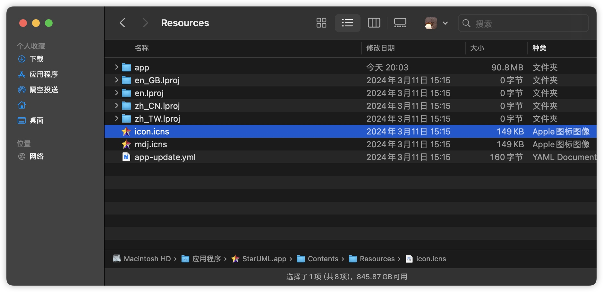

> 也就是删掉`app.asar`保留`app`文件夹就行了，其他不用删

OK
如果你是Windows，那么你可以直接打开StarUML
如果你是Mac，那么你还需要做以下操作

```bash
sudo xattr -cr /Applications/StarUML.app
```

Mac用户做完这一步，右键打开StarUML
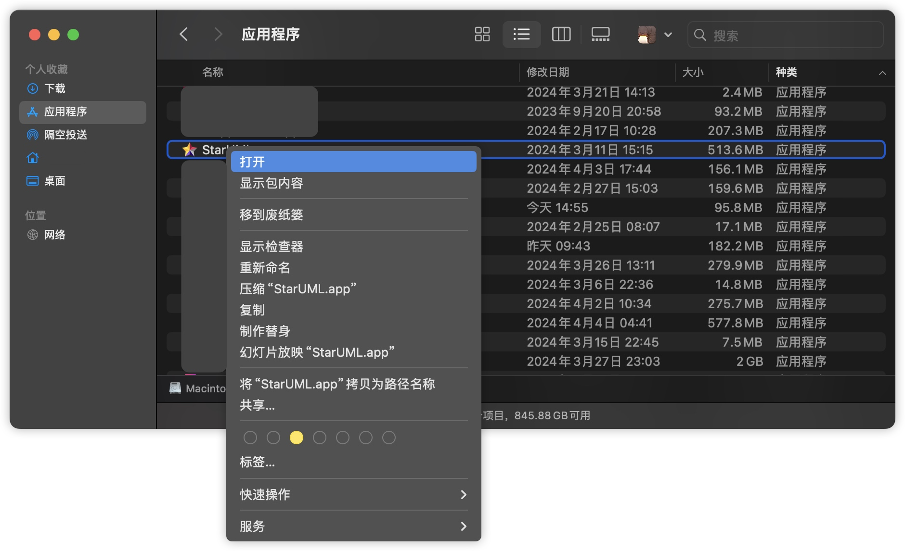
打开后还是提示未注册状态的，别着急，找到菜单栏 Help 后，点击`Enter License Key...`输入许可证
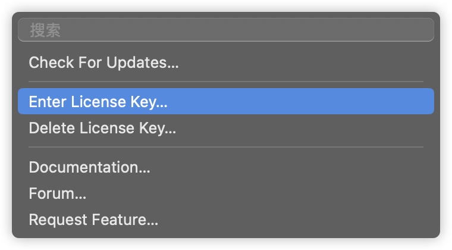
这时，无论你输入什么，只会得到一个结果
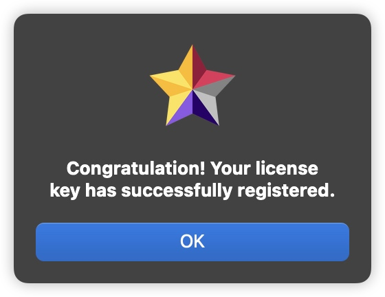
点击`About StarUML`后，我们的成果如下
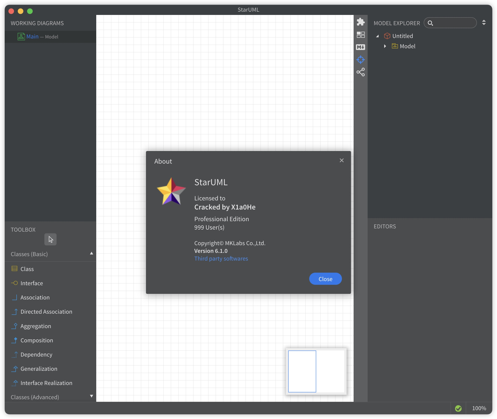

到这，我们就完成了对StarUML的破解操作，但这种三岁小孩都会的改代码行为，真的优雅吗？对于我来说，我并不会这么做，至少对于StarUML来说，该代码并不是一个完美的决定

# hook完美破解

如果你非常认真仔细读完上面的内容，相信StarUML改代码破解对你来说，并不困难

**接下来的教程和步骤有点难，但我会尽可能详细讲解，相信你也可以做到**

如果你拥有如下知识

- JavaScript
- NodeJS
- jQuery

接下来跟我做，我会带你把破解StarUML上升到更高的纬度

首先，我们来分析激活逻辑和流程

- 用户输入注册码
- 注册码发送给服务器进行校验
- 服务器返回许可信息
- 写入许可证文件

那么，我们是不是可以讲这个流程劫持下来，将校验服务器改为我们自己的呢，观察到 StarUML 对于网络请求发送是采用

```js
$.post()
```

这种非常像 jQuery 的形式，那么我们就有一个大胆的想法，把这个方法劫持下来呢？

将刚才的步骤还原，并在此解包，得到全新未修改的包后

还记得刚才我让你删掉`app.asar`保留`app`文件吗，为什么？StarUML的运行逻辑如下

- 如果仅存`app.asar`，那么StarUML就会依赖于`app.asar`
- 如果`app.asar`和`app`文件夹共存，那么StarUML还是会依赖于`app.asar`
- 但如果只有`app`文件夹，那么此时StarUML就会依赖于`app`文件夹

这样我们就可以更方便测试我们的代码了，新建一个`hook.js`文件，并存放到`app`文件夹中的`src`文件夹中，即与`src`
文件夹中的`app-context.js`同目录，就像这样
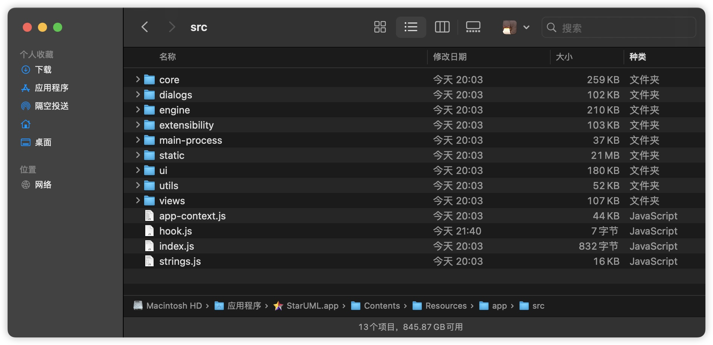

用VS Code打开`app-context.js`和`hook.js`文件后，在`app-context.js`中的非注释行上加入一行代码

```js
require("./hook.js");
```

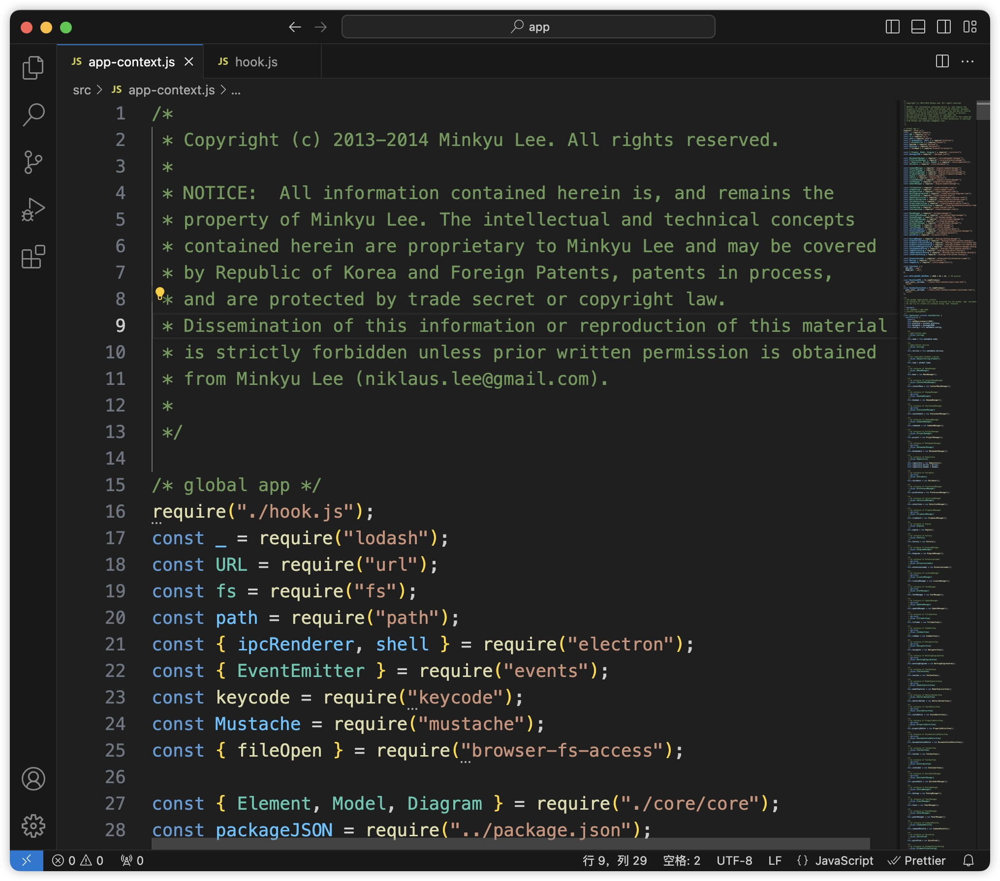

这一行是为了引入我们的`hook.js`并且执行里面的操作，当然，现在我们的`hook.js`为空，你可以在`hook.js`中输入

```js
console.log("Hey, hook.js is running!")
```

保存后，回到StarUML，或者重新打开StarUML，找到菜单栏的`Debug` - `Reload`，点击后再点击`Debug` - `Show DevTools`
，你会发现，刚才我们的这句话，已经被加载进去了
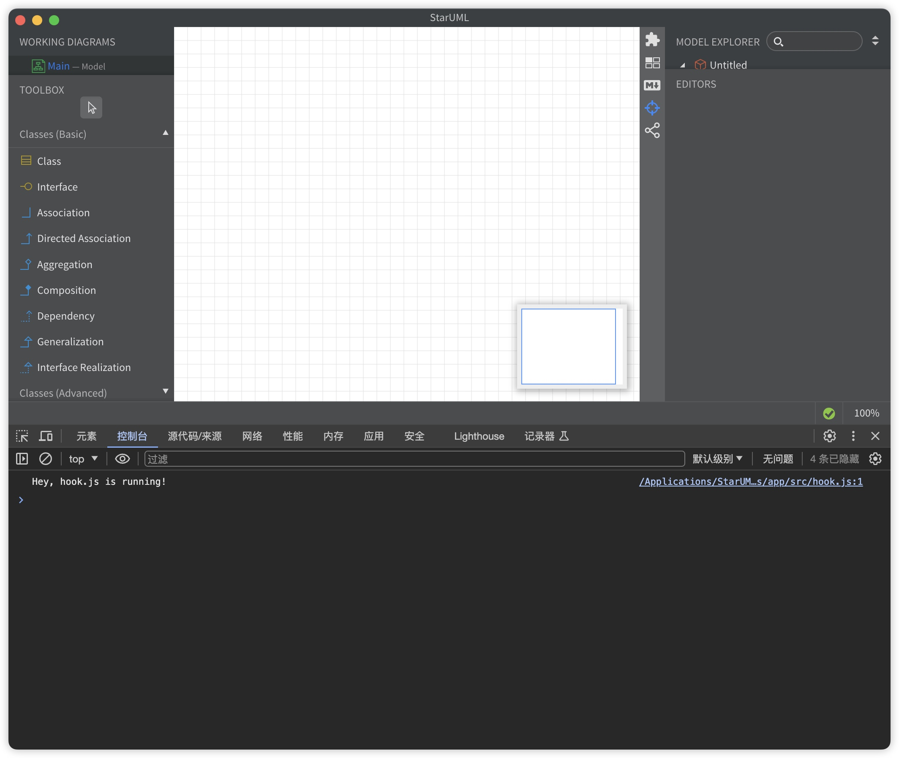
如果你也实现了这一步，非常好

刚才说了，我们可以对StarUML的网络请求方法进行拦截，那么，我们就需要在`hook.js`中，编写如下代码

```js
// hook.js所有代码
const originalPost = $.post;
console.log(originalPost);
```

保存后重复刚才的步骤，由于要多次重复，下文将不再赘述

1. 找到菜单栏的`Debug` - `Reload`

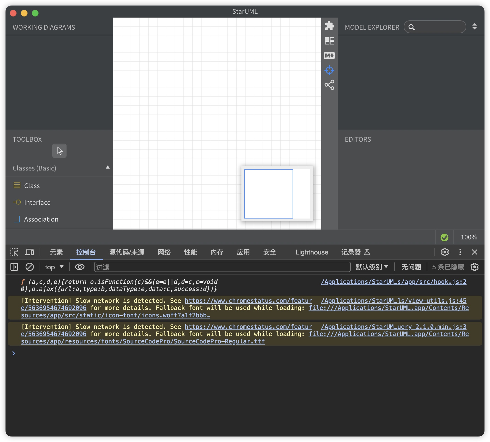
OK，原来的方法我们已经获取到了，那么我们就来给他加点东西

```js
// hook.js所有代码
const originalPost = $.post;
$.post = function (url, data, callback, dataType) {
    console.log("$.post()被劫持啦")
    if (url === "https://staruml.io/api/license/validate") {
        url = "http://127.0.0.1:3220/api/license/validate"
        console.log("url被替换啦！")
    }
    originalPost(url, data, callback, dataType);
}
```

接下来，我会带你理解这段代码

- 首先我们劫持了原有的`$.post()`方法，并复制给了一个变量`originalPost`
-
接着，如果请求的目标地址为`https://staruml.io/api/license/validate`，就修改为我们自己定义的目标地址，即`http://127.0.0.1:3220/api/license/validate`
- 接着，执行原来的`$.post()`方法

注意，这时，StarUML再次使用`$.post()`时，必然会通过我们劫持后的`$.post()`，保存后，重载，输入注册码点击OK，你会发现
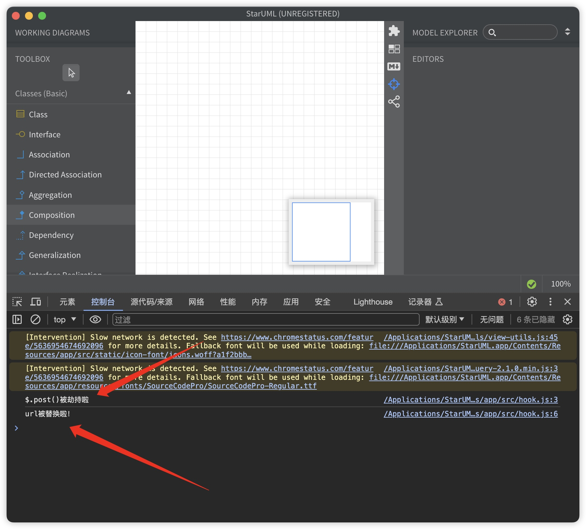
我们的目标达成了，如果你的JS基础足够扎实，你可以将劫持函数的代码写成下面的代码

```js
const originalPost = $.post;
$.post = (url, data, callback, dataType) => originalPost(url === "https://staruml.io/api/license/validate" ? "http://127.0.0.1:3220/api/license/validate" : url, data, callback, dataType);
```

接下来，我们还需要做的是，伪造一个许可信息，我们需要准备这几样东西

- 加密计算需要用的`crypto`
- 加密计算需要用的`SK`值
- 加密计算逻辑
- licenseInfo伪造信息

这些信息，除了最后一个，我们都可以从刚才的`license-manager.js`中获得，将这些东西用一个函数包裹后，代码如下

```js
const crypto = require("crypto");
const SK = "DF9B72CC966FBE3A46F99858C5AEE";
const generateLicenseInfo = () => {
    const licenseInfo = {
        name: "Cracked by X1a0He",
        product: "STARUML.V6",
        licenseType: "PRO",
        quantity: "999",
        timestamp: `4102329600000`,
        licenseKey: "",
    };
    licenseInfo.licenseKey = crypto
        .createHash("sha1")
        .update(`${SK}${licenseInfo.name}${SK}${licenseInfo.product}-${licenseInfo.licenseType}${SK}${licenseInfo.quantity}${SK}${licenseInfo.timestamp}${SK}`)
        .digest("hex")
        .toUpperCase();
    return licenseInfo;
};
console.log(generateLicenseInfo());
```

加上刚才的`$.post()`劫持代码

```js
const originalPost = $.post;
const crypto = require("crypto");
const SK = "DF9B72CC966FBE3A46F99858C5AEE";
$.post = (url, data, callback, dataType) =>
    originalPost(
        url === "https://staruml.io/api/license/validate"
            ? "http://127.0.0.1:3220/api/license/validate"
            : url,
        data,
        callback,
        dataType
    );

// 计算逻辑
const generateLicenseInfo = () => {
    const licenseInfo = {
        name: "Cracked by X1a0He",
        product: "STARUML.V6",
        licenseType: "PRO",
        quantity: "999",
        timestamp: `4102329600000`,
        licenseKey: "",
    };
    licenseInfo.licenseKey = crypto
        .createHash("sha1")
        .update(`${SK}${licenseInfo.name}${SK}${licenseInfo.product}-${licenseInfo.licenseType}${SK}${licenseInfo.quantity}${SK}${licenseInfo.timestamp}${SK}`)
        .digest("hex")
        .toUpperCase();
    return licenseInfo;
};
console.log(generateLicenseInfo());
```

保存，重载后，继续看看效果
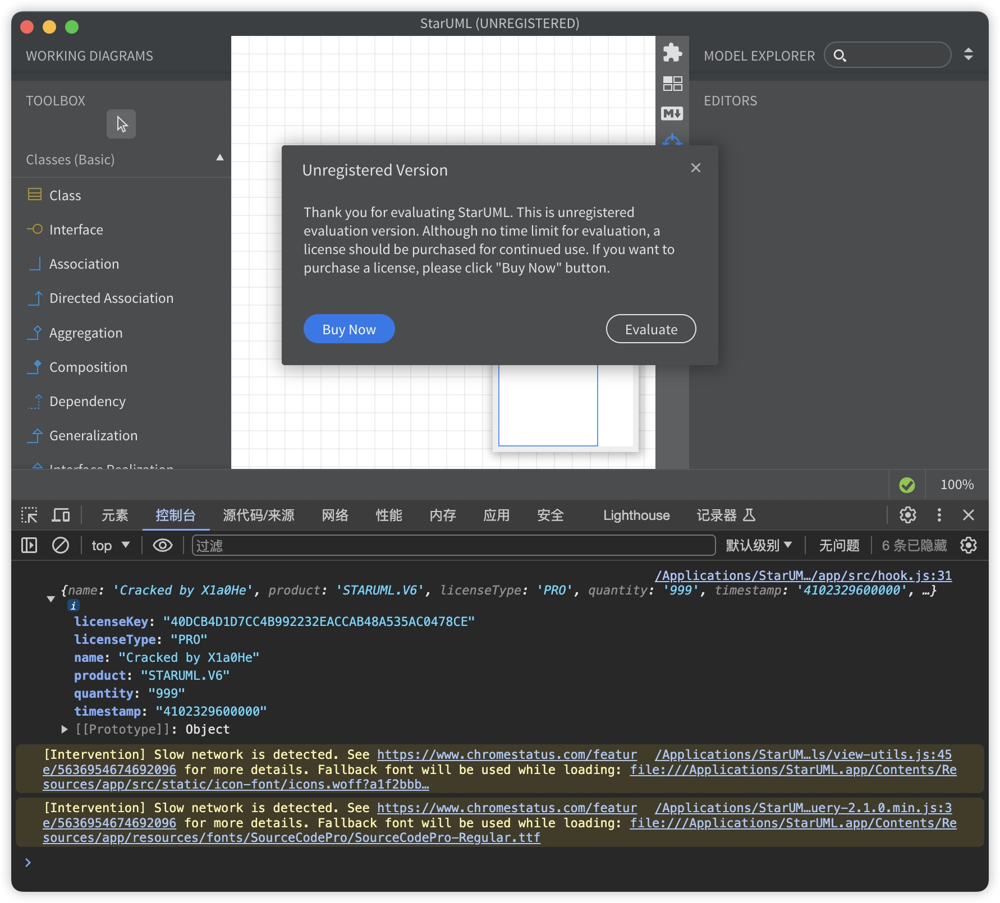
我们可以得到伪造的许可证信息如下

```json
{
  "name": "Cracked by X1a0He",
  "product": "STARUML.V6",
  "licenseType": "PRO",
  "quantity": "999",
  "timestamp": "4102329600000",
  "licenseKey": "40DCB4D1D7CC4B992232EACCAB48A535AC0478CE"
}
```

接下来，就该用NodeJS来创建服务器了，了解NodeJS创建服务器的你，应该对`http`内置模块不陌生，并且对`url`模块也不陌生，所以，让我们动手吧

在刚才的基础上加入以下的代码

```js
const http = require("http"), url = require("url");
const hostname = "127.0.0.1", port = 3220;
const server = http.createServer((req, res) => {
    const {pathname} = url.parse(req.url, true);
    if (pathname === "/api/license/validate") {
        res.setHeader("Content-Type", "application/json; charset=utf-8");
        res.statusCode = 200;
        res.end(JSON.stringify(generateLicenseInfo()));
        console.log(`已经返回了伪造的许可证信息`);
    }
});
server.listen(port, hostname, () => console.log(`劫持服务器启动！`));
```

我会给你解释这段代码的含义

- 引入必用模块`http`和`url`
- 定义本地服务器为`127.0.0.1`，端口号为`3220`
- 使用`http.createServer`创建一台服务器
- 将请求路径用`url.parse()`进行转换
- 判断路径是否为`/api/license/validate`
- 如果是，则返回伪造的许可证信息
- 如果不是，则原封不动放行
- 接着，监听(运行)该服务器

那么，结合刚才的代码，现在，你的代码应该是这样的

```js
const originalPost = $.post;
const crypto = require("crypto");
const SK = "DF9B72CC966FBE3A46F99858C5AEE";
const http = require("http"), url = require("url");
const hostname = "127.0.0.1", port = 3220;
$.post = (url, data, callback, dataType) =>
    originalPost(
        url === "https://staruml.io/api/license/validate"
            ? "http://127.0.0.1:3220/api/license/validate"
            : url,
        data,
        callback,
        dataType
    );

// 计算逻辑
const generateLicenseInfo = () => {
    const licenseInfo = {
        name: "Cracked by X1a0He",
        product: "STARUML.V6",
        licenseType: "PRO",
        quantity: "999",
        timestamp: `4102329600000`,
        licenseKey: "",
    };
    licenseInfo.licenseKey = crypto
        .createHash("sha1")
        .update(`${SK}${licenseInfo.name}${SK}${licenseInfo.product}-${licenseInfo.licenseType}${SK}${licenseInfo.quantity}${SK}${licenseInfo.timestamp}${SK}`)
        .digest("hex")
        .toUpperCase();
    return licenseInfo;
};
console.log(generateLicenseInfo());

const server = http.createServer((req, res) => {
    const {pathname} = url.parse(req.url, true);
    if (pathname === "/api/license/validate") {
        res.setHeader("Content-Type", "application/json; charset=utf-8");
        res.statusCode = 200;
        res.end(JSON.stringify(generateLicenseInfo()));
        console.log(`已经返回了伪造的许可证信息`);
    }
});
server.listen(port, hostname, () => console.log(`劫持服务器启动！`));
```

保存，重载后你会发现，当StarUML运行时，我们的劫持服务器同时被启动了


并且，这个时候，如果你去输入注册码，你会发现，无论你怎么输入，你都只会得到一个结果
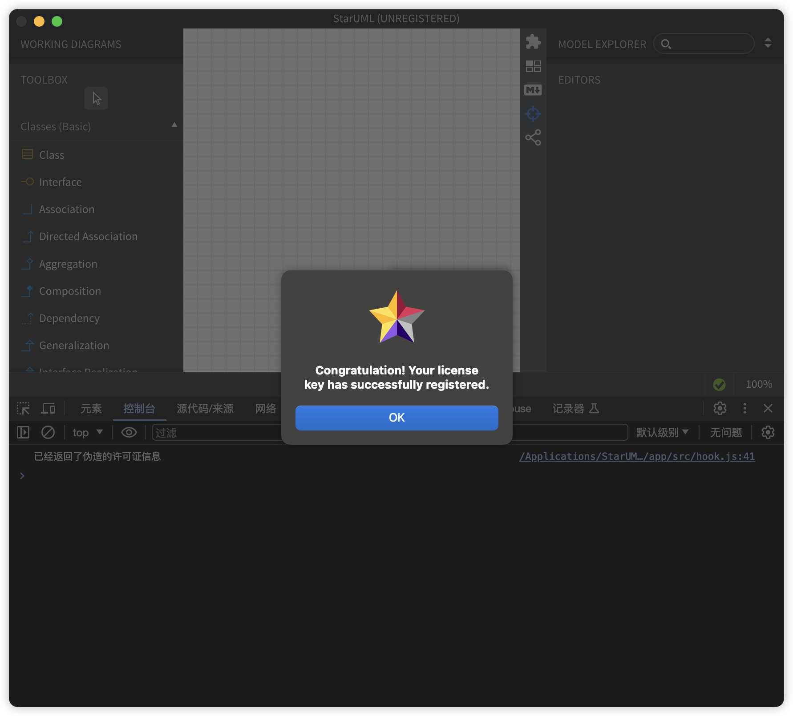

OK，到这里，我们就实现了 hook 劫持完美破解，如果你的JS基础足够扎实，你可以将代码进行完善，最终`hook.js`代码如下

```js
const http = require("http"), url = require("url"), crypto = require("crypto"), originalPost = $.post;
const SK = "DF9B72CC966FBE3A46F99858C5AEE", hostname = "127.0.0.1", port = 3220;
$.post = (url, data, callback, dataType) => originalPost(url === "https://staruml.io/api/license/validate" ? "http://127.0.0.1:3220/api/license/validate" : url, data, callback, dataType);
const generateLicenseInfo = () => {
    const licenseInfo = {
        name: "Cracked by X1a0He",
        product: "STARUML.V6",
        licenseType: "PRO",
        quantity: "999",
        timestamp: `4102329600000`,
        crackedAuthor: "X1a0He",
        licenseKey: ""
    };
    licenseInfo.licenseKey = crypto.createHash("sha1").update(`${SK}${licenseInfo.name}${SK}${licenseInfo.product}-${licenseInfo.licenseType}${SK}${licenseInfo.quantity}${SK}${licenseInfo.timestamp}${SK}`).digest("hex").toUpperCase();
    return licenseInfo;
};
const server = http.createServer((req, res) => {
    const {pathname} = url.parse(req.url, true);
    if (pathname === "/api/license/validate") {
        res.setHeader("Content-Type", "application/json; charset=utf-8");
        res.statusCode = 200;
        res.end(JSON.stringify(generateLicenseInfo()));
        console.log(`validate hook By X1a0He StarUML Crack Server`);
    }
});
server.listen(port, hostname, () => console.log(`X1a0He StarUML Crack Server is running`));
```
