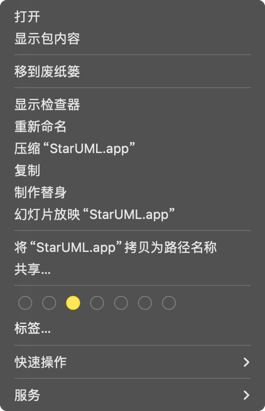
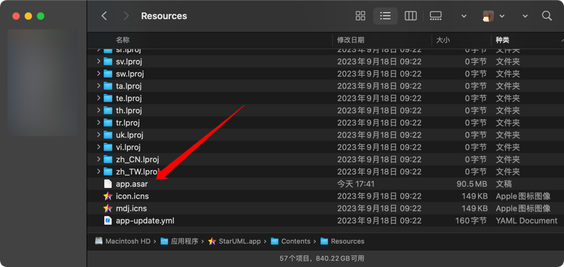

# Mac不想折腾无脑使用方法
既然你是用Mac的，脑子应该不会差到哪里去吧？因为我也是用Mac的，所以教程我就写少一点

在 `应用程序` 或 `Applications` 找到 `StarUML.app`

右键，找到 `显示包内容`



打开 `Contents/Resources`，往下滑，找到`app.asar`文件



把你下载好的`app.asar`文件拖进来替换掉，懂？

然后打开终端，输入如下命令修复损坏提示
```bash
sudo xattr -rd com.apple.quarantine /Applications/StarUML.app
```
输入你的密码即可