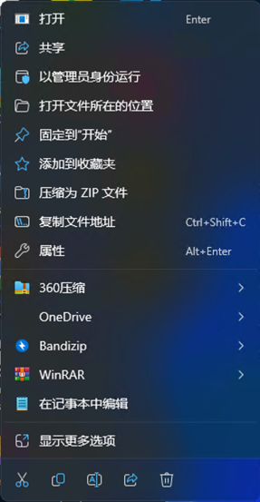
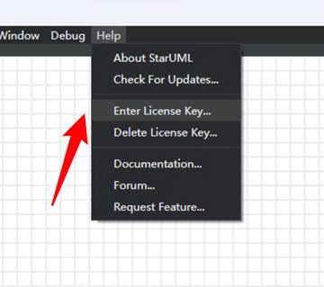
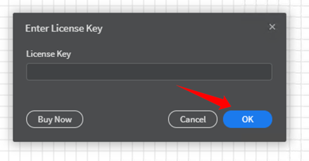
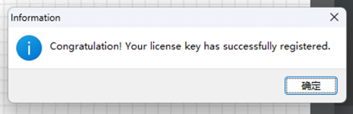
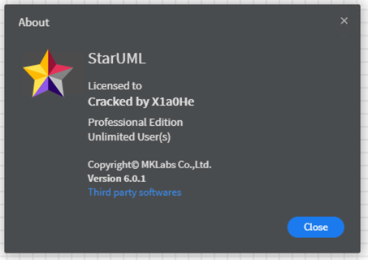

# Windows不想折腾无脑使用方法
- 下载仓库里的app.asar文件
- 找到StarUML的安装目录，一般你没改，不出意外的情况下是在
```text
C:\Program Files\StarUML
```
如果不在的话，你他妈不会自己找吗？右键那个b图标，找一个菜单项叫 "打开文件所在的位置"，点一下不就能找到了吗 \
还不会吗？看到了吗\

- 找到一个叫"resources"的文件夹，是不是看到一个叫`app.asar`的文件？
- 把你下载到的`app.asar`替换掉resources文件夹下的`app.asar`
- 相信文字应该能看懂吧，大学生

- 替换完之后，打开你的StarUML，找菜单栏
```text
Help - Enter License Key...
```


然后直接点OK，直接点OK，直接点OK


其实你随便输注册码也可以的，那你不直接点OK你为什么要浪费这一步的时间呢

点完OK之后就注册成功了



点击菜单栏，看到如下图就证明你还是有点脑子的
```text
Help - About StarUML
```

