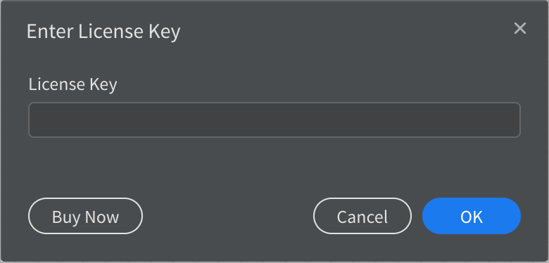
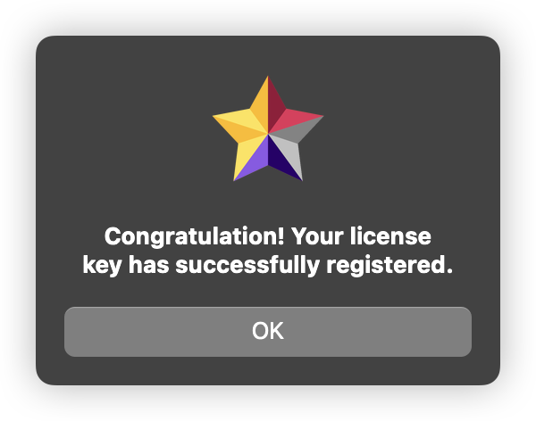
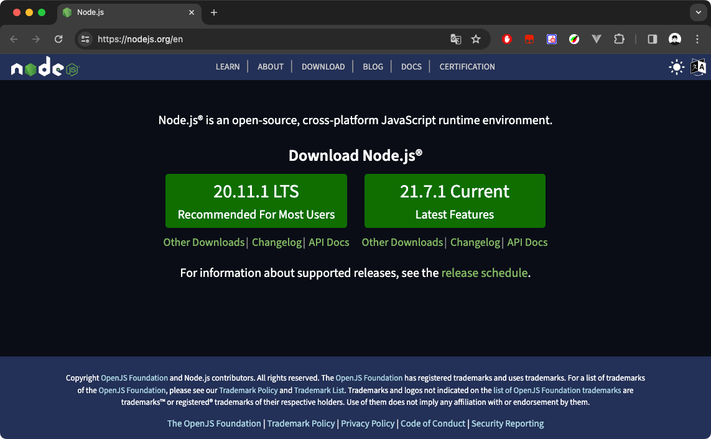
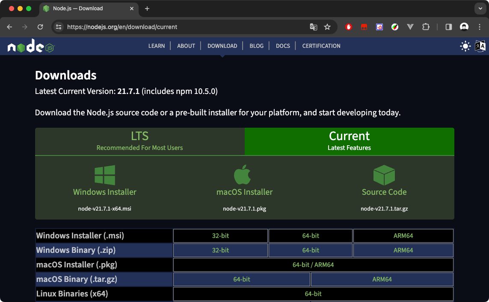
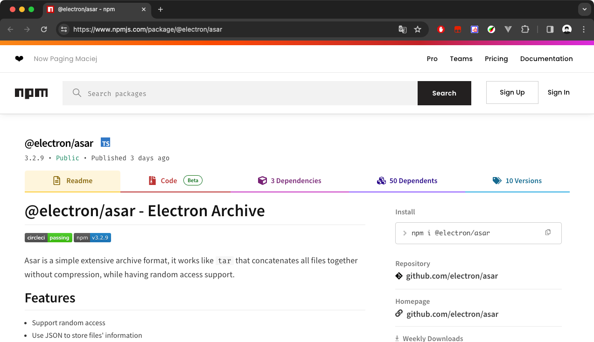

# By X1a0He

Since there is no need to translate English content into Chinese, the script only retains the weak invasive perfect
crack. In addition, the content of this document is translated by Google, so there may be errors.

# StarUML SourceCode

[StarUML-SourceCode](https://github.com/X1a0He/StarUML-SourceCode)

## Usage Instructions

**app.asar has been cracked perfectly, just follow the steps to use it**

* Click `Releases` on the right column, download `app.asar` or download `app.asar.zip` and unzip it
* Then follow the instructions on the `Releases` page and place `app.asar` in the specified directory
* After opening, select `Help` - `Enter License Key`, enter anything you want or just click OK





**⚠️⚠️⚠️ If you have a Python environment and want to run it with one click or study it yourself, please read on!!!**

# Latest Changelog

- [Historical Changelog](Update-log-en.md)

# Support status

- [x] macOS
    - [x] Cracked
    - [x] Chinese localization
    - [x] Fully automatic script support
- [x] Windows
    - [x] Cracked
    - [x] Chinese localization
    - [x] Fully automatic script support

----

# Read before use

1. Must be downloaded from the official website, only compatible with official website downloads, no matter what system
2. Regardless of the system, if you want to run the script, please run it with the highest authority, that is, 「sudo」 or
   「administrator」
3. Although the script backs up the target file in advance during operation, my suggestion is that you still need to
   back it up manually.
7. app.asar should be universal for Win and Mac. If you have any questions, please let me know.
8. Feedback: raise issues or [@X1a0He](https://t.me/X1a0He)

# Catalog

<!-- TOC -->

* [By X1a0He](#by-x1a0he)
* [StarUML SourceCode](#staruml-sourcecode)
    * [Usage Instructions](#usage-instructions)
* [Latest Changelog](#latest-changelog)
* [Support status](#support-status)
* [Read before use](#read-before-use)
* [Catalog](#catalog)
* [Crack support version](#crack-support-version)
* [There are two ways to crack](#there-are-two-ways-to-crack)
* [Weakly Intrusive](#weakly-intrusive)
* [Strong Intrusive](#strong-intrusive)
    * [The perfect way to use it on macOS](#the-perfect-way-to-use-it-on-macos)
    * [If you are a developer](#if-you-are-a-developer)
        * [Basic conditions for running the script](#basic-conditions-for-running-the-script)
        * [NodeJS install](#nodejs-install)
        * [asar installation](#asar-installation)
        * [Python Installation](#python-installation)

<!-- TOC -->

# Crack support version

|   App   |    Version     | Cracked | Mac | Windows |                    Link                    |
|:-------:|:--------------:|:-------:|:---:|:-------:|:------------------------------------------:|
| StarUML | 6.0.1 - Latest |    ✅    |  ✅  |    ✅    | [https://staruml.io/](https://staruml.io/) |

# There are two ways to crack

> The evaluation mode introduced in 6.2.0 may not have been updated in time, but the script has been perfectly cracked

Note that you can choose either of the two methods, both of which need to meet the
conditions[Basic conditions for running the script](#Basic-conditions-for-running-the-script)

- [Strong Intrusive](#Strong-Intrusive): Modify the license-manager.js file to achieve the purpose of cracking, perfect
  cracking
- [Weakly Intrusive](#Weakly-Intrusive): By hijacking the $.post method to hook the verification request and return the
  built-in data, a perfect crack

# Weakly Intrusive

1. Put the hook.js file in the unpacked `src` directory, that is, in the same directory as `app-context.js`
2. Under the comment in app-cocntext.js, add a line `require("./hook");` above `const _ = require("lodash");`, that is

```js
require("./hook");          // <---------- add this line
const _ = require("lodash");
const URL = require("url");
const fs = require("fs");
```

3. Start StarUML, enter the license key or click OK to enjoy it.

# Strong Intrusive

> 1. Windows and macOS are the same way to crack.
> 2. If you have Python on your machine, you can run the script yourself. The script in the repository uses weak
     invasive cracking by default.
> 3. Logically speaking, the cracking is universal, unless StarUML does not use Electron anymore!

## The perfect way to use it on macOS

Make sure your Mac has the best operating
environment，[Basic conditions for running the script](#Basic-conditions-for-running-the-script)

```bash
cd StarUML-CrackedAndTranslate
sudo python3 main-en.py
# Just select the corresponding operation, the whole process is fully automatic without intervention
```

## If you are a developer

**Since I usually use Mac💻, the tutorial here focuses on Mac. Windows is similar, please be informed✅**

**PS: ⚠️I wrote the Python script for convenience. It is recommended to read the code and study it before deciding
whether to run it yourself.**

----

> This project document explains as follows
> - main-en.py Universal one-key script, since Chinese is not required, only the cracking function is retained

### Basic conditions for running the script

The prerequisites for running `main-en.py` are as follows

- macOS please make sure `NodeJS`, `asar`, `Python` are installed

- Open cmd in Windows and terminal in macOS, and enter the following command to check whether `NodeJS` and `asar`
  support exists

```Bash
# Node.JS & npm
node -v && npm -v

# Check if asar is installed
asar --version

# Check if Python is installed
# Python2
python --version

# Python3
python3 --version
```

If an error occurs in any of the above commands, you need to install it in advance. Only the official installation
method is provided here. For other methods (such as HomeBrew installation on Mac), please search for them yourself.

### NodeJS install

NodeJS official website: [https://nodejs.org/](https://nodejs.org/)

NodeJS Current version download: [https://nodejs.org/en/download/current](https://nodejs.org/en/download/current)

**⚠️ NPM will be installed along with NodeJS**

**❗️❗️❗️I recommend the Current version, which is the version on the right side of the picture.**



After my attempt, I found that if I click on the right side to download on Windows, it will give you a compressed
package, so my suggestion is to click on the [NodeJS Current version](https://nodejs.org/en/download/current)



Click on the corresponding system icon to download. If you still don't know how to install it，fine，u r a fxxking genius!

### asar installation

Once you have installed NodeJS and NPM, run the following command to install `asar`

```Bash
npm -g i @electron/asar
```

This command is provided by [@electron/asar](https://www.npmjs.com/package/@electron/asar)

Github: [https://github.com/electron/asar](https://github.com/electron/asar)



Please search for other installation methods by yourself, I don’t know how to do it🤡.

### Python Installation

Python official website: [https://www.python.org/downloads/](https://www.python.org/downloads/)


This address will detect the current operating system by default and guide you to download the corresponding
installation package. You will understand the installation process yourself.

At this point, you have reached the conditions for running the script