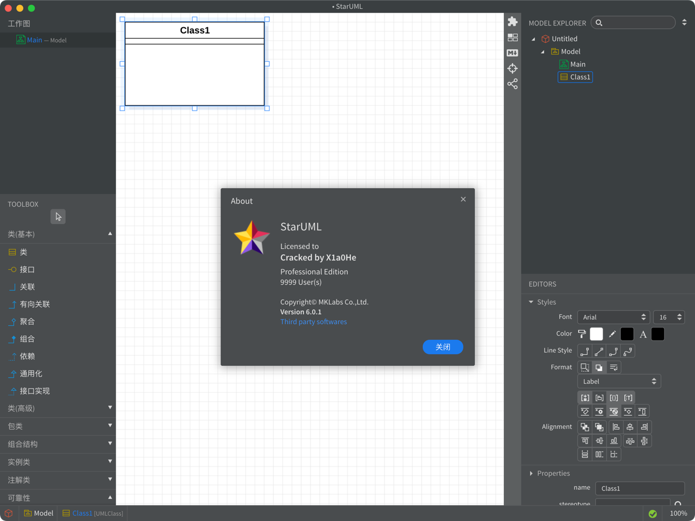
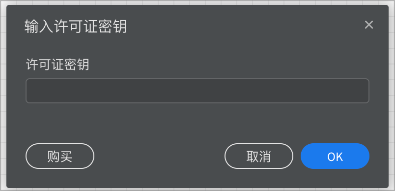
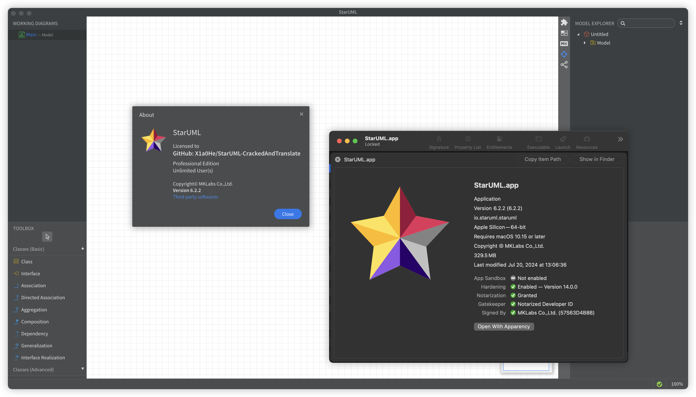

# 免责声明

**本仓库仅用于学习交流使用，请勿用于非法用途，造成一切后果与作者无关**

**点开本仓库即默认一切后果自负**

# 文档选择

[**中文文档**](cn/readme-cn.md) | [**Document for English**](en/readme-en.md)

# 汉化效果



# StarUML源代码仓库

[StarUML-SourceCode](https://github.com/X1a0He/StarUML-SourceCode)

## 使用方法

* 点击右边栏的 `Releases` 后，下载 `app.asar` 或者 下载 `app.asar.zip` 解压

* 然后按照 `Releases` 页面的指引，将 `app.asar` 放在指定目录下

* 打开后，选择 `帮助` - `输入许可证密钥`，随便输入或者直接点击OK即可




# 最新更新日志

- [历史更新日志](Update-log.md)

- 2024-11-04 10:30 更新日志

```markdown
1. 修改关于页面的 Licensed to 字样
2. 调整 hook.js 的部分字段
3. 移除了汉化后还原为英文的流程，改为还原为未修改的包
4. 增加了部分日志输出提示
5. 优化了备份操作

PS: 当前版本在选择还原操作时，会还原成未修改的状态，即未破解，未汉化的状态
```

----

# Surge 脚本激活



> 注意，此方法不在脚本处理范围内，请有动手能力的朋友自行动手添加\
> 该方法无汉化功能，仅方便激活\
> 该方法优缺点如下
>
> **优点**
> - 无侵入式，不修改原app
> - 支持直接从官网进行更新，无需再次激活
>
> **缺点**
> - 必须才用支持脚本运行的App，如: Surge, Stash 等
> - 打开StarUML的同时，必须开启脚本，否则可能会出现激活失败或被还原的情况

## 添加方式

需要打开HTTPS解密，并且添加MitM主机名: `staruml.io`

**自己写配置**

```config
[Script]
StarUML = type=http-request,pattern=^https://staruml.io/api/license/validate,requires-body=1,max-size=0,debug=1,script-path=staruml.js
```

**手动添加脚本**
把 `staruml.js` 放在 `/Users/$HOME/Library/Application Support/Surge/Profiles` 目录下

脚本名: 自定义 \
脚本类型: HTTP Request \
URL正则表达式: `^https://staruml.io/api/license/validate`

----

# 支持状态

- [x] Mac
    - [x] 破解
    - [x] 汉化
    - [x] 一键脚本支持
- [x] Windows
    - [x] 破解
    - [x] 汉化
    - [x] 一键脚本支持

# 联系方式

提issues或者[@X1a0He](https://t.me/X1a0He)

# 目录

<!-- TOC -->

* [文档选择](#文档选择)
* [汉化效果](#汉化效果)
* [StarUML源代码仓库](#staruml源代码仓库)
    * [使用方法](#使用方法)
* [最新更新日志](#最新更新日志)
* [Surge 脚本激活](#surge-脚本激活)
    * [添加方式](#添加方式)
* [支持状态](#支持状态)
* [联系方式](#联系方式)
* [目录](#目录)
* [支持状态](#支持状态-1)
* [本项目优点](#本项目优点)

<!-- TOC -->

# 支持状态

|   App   |       版本       | 汉化程度 | Cracked | Mac | Windows |                    下载地址                    |
|:-------:|:--------------:|:----:|:-------:|:---:|:-------:|:------------------------------------------:|
| StarUML | 6.0.1 - Latest | 99%  |    ✅    |  ✅  |    ✅    | [https://staruml.io/](https://staruml.io/) |

# 本项目优点

- 优雅且完美破解
- 支持中英文双语文档
- 懒人直接使用`Release`中的app.asar，按照提示操作即可
- 全开源代码，无任何风险
- 支持最新版本