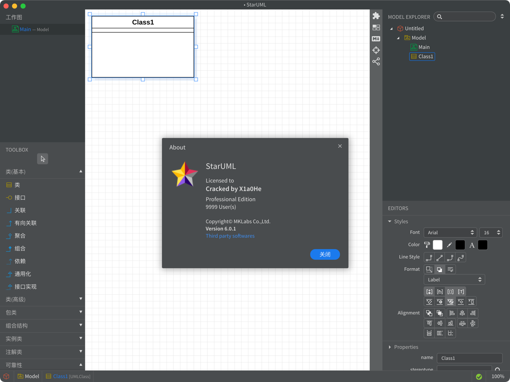

# 免责声明

**本仓库仅用于学习交流使用，请勿用于非法用途，造成一切后果与作者无关**

**点开本仓库即默认一切后果自负**

# 致搬运者与无知的人

**自 2024.12.10 起，仓库 hook 已改为破解完成启动即用，无需再繁琐点击输入许可证**

1. 仓库实现的 StarUML 破解方式都是全网唯一，永远适配最新版本
2. 本仓库是首个修改评估模式，并实现 hook 同时修改评估模式的
3. 同时也是首个完成 6.3.1 版本的最新校验拦截，并自 6.3.1 版本开始，无需再繁琐点击输入许可证
4. 全网首个破解 StarUML v7 版本

⚠️⚠️⚠️\
**搬运的请注明出处和作者**\
**搬运汉化请注明出处和作者**\
**已经在很多地方包括公众号发现搬运不注明作者的**\
**搬运的还拿去卖的，看看你户口本上是不是就剩你一个了**

另外，一些无知的人请别拿网上的垃圾教程来对标本仓库，改改标识就标识破解成功的教程和人收收味，别来沾边

# 目录

<!-- TOC -->

* [免责声明](#免责声明)
* [致搬运者与无知的人](#致搬运者与无知的人)
* [目录](#目录)
* [支持范围](#支持范围)
* [v7 处理效果](#v7-处理效果)
* [使用方法](#使用方法)
    * [下载成品](#下载成品)
    * [运行脚本](#运行脚本)
        * [准备环境](#准备环境)
        * [启动与选项](#启动与选项)
* [备份与恢复](#备份与恢复)
* [常见问题](#常见问题)
* [更新日志与反馈](#更新日志与反馈)

<!-- TOC -->

# 支持范围

请使用 [StarUML 官网](https://staruml.io/)安装包。脚本目前使用以下固定资源目录，不会自动查找自定义安装位置：

| 系统    | 资源目录                                       | 说明                   |
|---------|------------------------------------------------|------------------------|
| macOS   | `/Applications/StarUML.app/Contents/Resources` | 使用 `sudo` 运行脚本   |
| Windows | `C:\Program Files\StarUML\resources`           | 在管理员终端运行脚本   |
| Linux   | `/opt/StarUML/resources`                       | 已有处理分支，尚未实测 |

# v7 处理效果



# 使用方法

## 下载成品

1. 在本仓库的 Releases 中选择与本机 StarUML 版本对应的发布包，下载 `app.asar` 或解压 `app.asar.zip`。
2. 完全退出 StarUML，另存原始 `app.asar`，按该 Release 的说明替换文件。
3. 完成后手动打开 StarUML。包含 hook 的成品在初始化成功后无需手动输入许可证。

以具体 Release 的版本、平台和安装说明为准。手动替换文件不会自动创建脚本所用的恢复备份。

## 运行脚本

先完整下载或克隆本项目，保留文件之间的目录关系。

运行前先打开一次官方 StarUML，让它创建用户数据目录，再保存工作并完全退出。

更新 StarUML 后也应先打开一次，尤其是 macOS 15 及以上版本。

操作前另存原始应用文件和重要模型。

### 准备环境

- 安装 [Python](https://www.python.org/downloads/)。
- 处理 `app.asar` 时，需要 [Node.js 与 npm](https://nodejs.org/)以及 `@electron/asar`。Node.js
  版本须满足所安装的 [asar 官方要求](https://github.com/electron/asar#install)。
- 安装 asar 并确认当前终端能够找到命令：

```bash
npm install -g --engine-strict @electron/asar
node --version
npm --version
asar --version
```

仅处理已有的解包 `app` 目录且不存在 `app.asar` 时，脚本不调用 asar。

### 启动与选项

在包含 `main.py` 的项目根目录打开终端。macOS 或 Linux：

```bash
python3 --version
sudo python3 main.py
```

Windows 使用管理员 PowerShell 或命令提示符，并确认 `python` 指向 Python 3：

```powershell
python --version
python main.py
```

按提示选择：

| 输入 | 操作                   |
|------|------------------------|
| `0`  | 仅破解                 |
| `1`  | 仅汉化，不执行破解步骤 |
| `2`  | 破解并汉化             |
| `3`  | 还原                   |
| `-1` | 退出                   |

处理规则：

- 存在 `app.asar`：优先处理，执行所选操作后重新打包；打包成功后移除工作用的 `app` 目录。
- 只有 `app` 目录：直接处理该目录，不额外打包。
- `app.asar` 与 `app` 同时存在：仍以 `app.asar` 为输入。

完成后手动打开 StarUML。

当前 hook 在初始化时准备本地激活数据；

# 备份与恢复

以下备份均位于上表的资源目录中，作用不同：

| 备份                    | 创建时机                                     | 恢复方式                                                                   |
|-------------------------|----------------------------------------------|----------------------------------------------------------------------------|
| `app.asar.original`     | 处理 `app.asar` 时创建；已有同名备份不会覆盖 | 菜单选项 `3` 将其复制回 `app.asar`，随后移除该备份                         |
| `app.zh-backup-时间戳/` | 汉化实际写入前，保存即将修改的已有文件       | 按相对路径复制回对应的解包 `app` 目录；若应用使用 `app.asar`，还需重新打包 |

**菜单中的“还原所有”只恢复 `app.asar.original`，不是完整回滚。** 它不会恢复已清理的用户许可证文件，也不会自动恢复解包目录或清理由汉化新增的文件。

汉化备份仅保存已有文件的原内容，不包含此前不存在的 `src/localization/zh-cn.js`，也不保证保存破解前状态：选项 `2`
先执行破解，再进入汉化。仅有解包目录时，建议操作前完整备份该目录。

# 常见问题

- **提示未检测到 asar：** 确认运行脚本的终端能执行 `asar --version`。macOS/Linux 使用 `sudo` 后的 PATH 可能与普通终端不同。
- **提示未检测到应用：** 核对安装位置是否与上表一致；脚本目前不提供自定义安装路径选项。
- **提示先打开一次 StarUML：** 先正常打开并退出应用，再运行脚本。若仍出现提示，核对脚本执行身份与它定位的用户数据目录。
- **词条未命中或无法识别主进程启动结构：** 保留错误信息，核对 StarUML 版本和输入文件是否已被其他工具修改，不要跳过匹配检查继续写入。
- **macOS 提示应用已损坏：** 先核对安装包来源和发布包版本，必要时恢复原始文件。脚本会输出移除隔离属性的手动命令，但不会自动执行；该命令不能修复版本不匹配或文件内容损坏。

# 更新日志与反馈

2026-10-09：

- 完善 v7 汉化并移除 v6 支持。
- 修正 v7 初始化与许可证兼容问题。
- 清理旧版脚本与英文文档入口。

[历史更新日志](change-log.md) · [StarUML 源码仓库](https://github.com/X1a0He/StarUML-SourceCode)

译文或兼容问题请在本仓库提交 Issue，附上系统、StarUML
版本、所选操作及错误信息；也可联系 [@X1a0He_bot](https://t.me/X1a0He_bot)。
