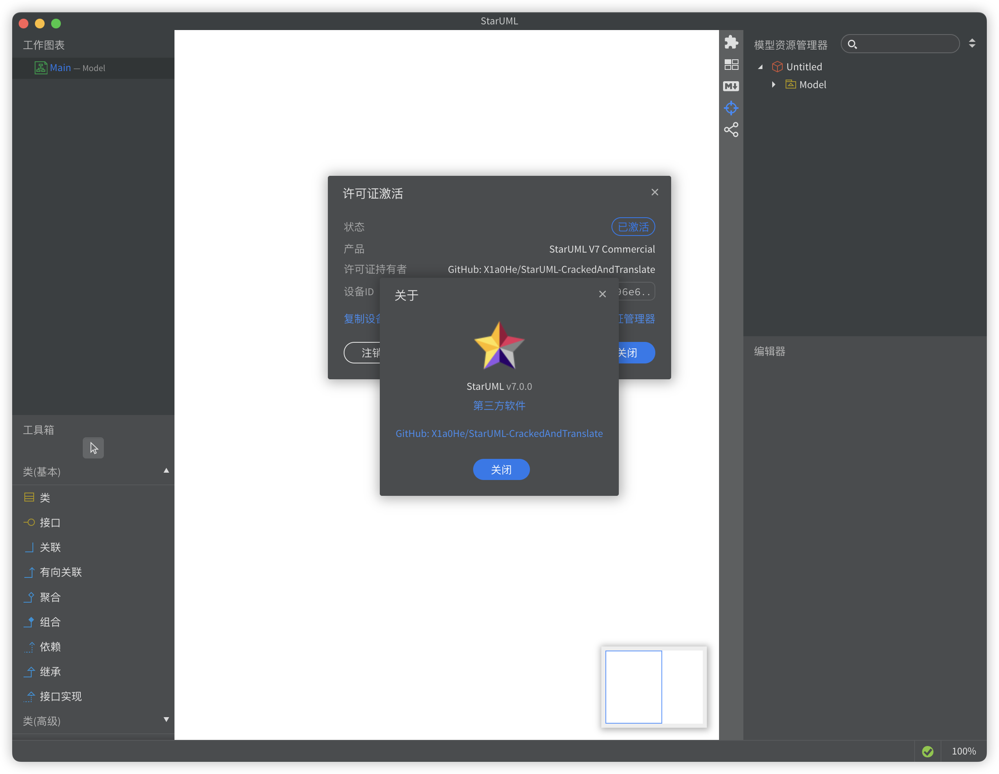

# StarUML汉化效果



# StarUML源代码仓库

[StarUML-SourceCode](https://github.com/X1a0He/StarUML-SourceCode)

# 佛系更新

去你妈的傻逼UML老师，给老子打88分，你是傻逼吧

以后佛系更新

## 懒人使用方法

点击右边栏的 `Releases` 后，下载 `app.asar` 或者 下载 `app.asar.zip` 解压

然后按照 `Releases` 页面的指引，将 `app.asar` 放在指定目录下

如果你有 Python 环境，想一键运行，往下看！！！

# 最新更新日志

- 2024-07-18 03:10 Update

```md
1. 修复评估天数修改失败的问题
2. 新增macOS下未安装StarUML的提示，且终止脚本运行
3. 新增了几处操作日志输出
```

- [历史更新日志](Update-log.md)

# 支持状态

- [x] Mac
    - [x] 破解(Cracked)
    - [x] 汉化(Chinese localization)
    - [x] 一键脚本支持
- [x] Windows
    - [x] 破解(Cracked)
    - [x] 汉化(Chinese localization)
    - [x] 一键脚本支持

----

# 为什么不是完全汉化

**最主要原因: 懒**

经过对 StarUML 源码的分析来看，如果对右下角的属性面板进行汉化的话，某处的json就无法获取到对应的值\
会连带出现以下bug

- 无法生成类图
- 生成类图后不存在，仅存在操作UI
- 其他未知bugs

综上所述，未对 StarUML 进行完全汉化

----

😁 作者暴脾气，但很温柔，素质很高，望周知

⚠️ 项目不更新不代表不能用，你不会自己看看吗

本项目来源由于自己大学要上UML必修课，书本上推荐的软件\
本项目汉化不完全，但如果你是一个大学生或工作的社畜，相信剩下那一点点b英文应该难不到你

如果你大学生看不懂那剩下没汉化的英文，你还上个集贸UML课，考试你必挂\
如果你社畜看不懂那些剩下没汉化的英文，那你赶紧上什么58同城，BOSS直聘赶紧找个b洗碗工洗洗盘子得了

而且最重要的一点，老子上传上来的初心是他妈给自己用的，老子2天时间完成了95%的汉化，剩下那5%的汉化你看不懂你他妈还用牛魔呢？

# 用前必读

1. 必须必须从官网下载，只适配官网下载的，无论什么系统，不然你就别来找骂！
2. 无论什么系统，如果你要跑脚本，请你以最高权限跑，即「sudo」或者「管理员」
3. 如果你有问题，请先确保自己的脑子🧠是清醒状态
4. 如果你在自己折腾途中，遇到还原出问题，或部分有问题，我可以告知你，你既然要汉化，你还要还原，你不是弱智谁是弱智？
5. 由于存在大量英文，本人为🇨🇳人，看不懂英文也很正常，所以翻译结果选择机翻，包含但不限于百度翻译，Google翻译，GPT翻译，搜索术语结果，所以如果出现有翻译错误，请你提issues，虽然我不一定会看
6. 虽然脚本在操作的时候对目标文件进行提前备份，但我的建议是你还是要手动备份一次
7. app.asar应该是Win和Mac通用的，如果有问题，可以通知我
8. 反馈方式: 提issues或者[@X1a0He](https://t.me/X1a0He)

# 目录

<!-- TOC -->

* [StarUML汉化效果](#staruml汉化效果)
* [最新更新日志](#最新更新日志)
* [支持状态](#支持状态)
* [为什么不是完全汉化](#为什么不是完全汉化)
* [用前必读](#用前必读)
* [目录](#目录)
* [支持状态](#支持状态-1)
* [破解可以采用两种方法](#破解可以采用两种方法)
* [弱侵入式优雅完美破解](#弱侵入式优雅完美破解)
* [使用方法](#使用方法)
    * [Mac最完美使用方法](#mac最完美使用方法)
    * [不想折腾无脑使用](#不想折腾无脑使用)
    * [想折腾又有耐心的使用](#想折腾又有耐心的使用)
        * [运行脚本的基本条件](#运行脚本的基本条件)
        * [NodeJS安装](#nodejs安装)
        * [asar安装](#asar安装)
        * [Python安装](#python安装)

<!-- TOC -->

# 支持状态

|   App   |       版本       | 汉化程度 | Cracked | Mac | Windows |                    下载地址                    |
|:-------:|:--------------:|:----:|:-------:|:---:|:-------:|:------------------------------------------:|
| StarUML | 6.0.1 - Latest | 99%  |    ✅    |  ✅  |    ✅    | [https://staruml.io/](https://staruml.io/) |

# 破解可以采用两种方法

⚠️ 小白什么都不懂就别tm自己瞎折腾了 ⚠️

注意，两种方式取其中一种即可，均需要满足[运行脚本的基本条件](#运行脚本的基本条件)

- [强侵入式](#使用方法): 修改license-manager.js文件达到破解目的，完美破解
- [弱侵入式](#弱侵入式优雅完美破解): 通过劫持$.post方法来hook验证请求，返回内置数据，完美破解

# 弱侵入式优雅完美破解

1. 将hook.js文件放到解包后的 `src` 目录下，即与`app-context.js`同目录
2. 在 `app-cocntext.js` 中的注释下，也就是`const _ = require("lodash");` 的上面加一行 `require("./hook");`，即

```js
require("./hook");          // <---------- 添加这一行
const _ = require("lodash");
const URL = require("url");
const fs = require("fs");
```

3. 启动 StarUML，随便输入注册码或直接点击OK即可完成完美破解

# 使用方法

> 本项目使用最基本要求
> 1. 先确保你的脑子正常，脑残人士请勿使用
> 2. Windows和Mac是nm通用的方法，别叫了
> 3. 如果你的机器上有Python，那么你可以自己跑一遍脚本，或者自己改，但是我已经完成了几乎99%的工作了
> 4. 按道理来说，汉化是通用的，除非StarUML不用Electron了，但是也够你大学生毕业或者社畜工作摸鱼用了

## Mac最完美使用方法

请确保你的Mac拥有最佳的运行环境，[运行脚本的基本条件](#运行脚本的基本条件)

```bash
cd StarUML-CrackedAndTranslate
sudo python3 main.py
# 选择对应的操作即可，全程无需干预全自动
```

## 想折腾又有耐心的使用

**因本人常用电脑为Mac💻，所以此处教程以Mac为重点，Windows大同小异，望周知✅**

**PS: ⚠️我是为了方便才写Python脚本全自动的，建议看过代码并研究完一遍才决定要不要自己运行**

----

既然你有耐心，且想折腾，那我就懒得跟你说遇到问题的解决方法了，你完全可以自己查 百度 or Google

> 本项目文件解释如下
> - main.py 通用一键脚本，可用于仅破解，仅汉化，破解+汉化
> - StarUML_Language.json 名如其意，负责存放中英双语的Json文件

### 运行脚本的基本条件

运行上述两个Python文件的前提条件如下

- 最好本机已安装好`NodeJS`, `asar`, `Python`\
  Windows打开cmd，Mac打开终端，输入如下命令查看是否存在`NodeJS`和`asar`支持

```Bash
# 查看当前node和npm版本，建议为最新
node -v && npm -v

# 查看asar是否已安装
asar --version

# 查看Python是否已安装
# Python2
python --version

# Python3
python3 --version
```

若上述命令中，存在某个命令出现错误，则你需要提前进行安装，此处仅提供官方安装方法，其他方法(比如Mac的HomeBrew安装)请自行搜索

### NodeJS安装

NodeJS官方网址: [https://nodejs.org/](https://nodejs.org/)

NodeJS Current版本下载: [https://nodejs.org/en/download/current](https://nodejs.org/en/download/current)

**⚠️ NPM 会随着 NodeJS 一同安装**

**❗️❗️❗️建议下Current版本，也就是图中右边的版本**


但是！但是！但是！经过我的尝试，Windows上直接点右边下载，会给你下一个压缩包的，所以我的建议是点上面的[NodeJS Current版本](https://nodejs.org/en/download/current)
下载


点击自己对应的系统图标下载即可，如果你还是不会，OK，you are a fucking genius!

### asar安装

当你完成了 NodeJS 和 NPM 的安装后，运行下列命令进行安装 `asar`

```Bash
npm -g i @electron/asar
```

该命令由 [@electron/asar](https://www.npmjs.com/package/@electron/asar)
提供，[官方Github地址](https://github.com/electron/asar)


其他安装方法请自行搜索，我不会🤡，嘿嘿😁

### Python安装

Python官方地址: [https://www.python.org/downloads/](https://www.python.org/downloads/)


该地址会默认检测当前操作系统并指引你下载对应安装包，安装过程自行领会

到此，你已经达到了运行脚本的条件了